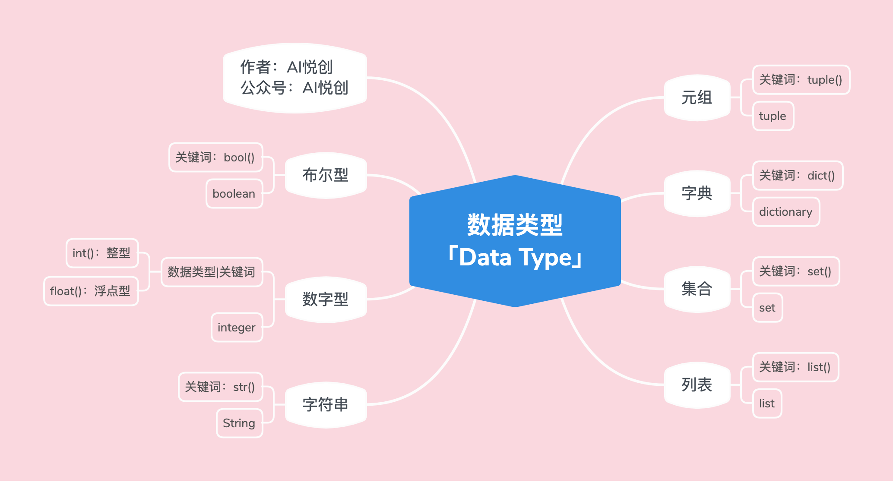

```markdown
title: Data Types
date: 2023-12-17 13:40:10
author: Alexa
isOriginal: true
category: 
    - Python
tag:
    - web
    - typora
icon: coding
sticky: false
star: false
article: true
timeline: true
image: false
navbar: true
sidebarIcon: true
headerDepth: 5
comment: true
lastUpdated: true
```

## Data Types



## 1. Numeric Types [int, float]

### 1.1 Code Examples

1. Integer

    ```python
    int_num = 1
    t = type(int_num)  # check data type
    print(int_num)
    print("int num type is:>>>", t)
    print("Directly check data type and print:>>>", t)
    
    # output
    1
    int num type is:>>> <class 'int'>
    Directly check data type and print:>>> <class 'int'>

2. Float

    ```python
    float_num = 1.5
    t = type(float_num)  # check data type
    print(float_num)
    print("float num type is:>>>", t)
    print("Directly check data type and print:>>>", t)
    
    # output
    1.5
    float num type is:>>> <class 'float'>
    Directly check data type and print:>>> <class 'float'>
    ```

## 2. Strings [str]

### 2.1 Code Example

```python
string = "Hello Alexa"
t = type(string)
print(string)
print("string type is:>>>", t)
print("Directly check data type and print:>>>", t)

# output
Hello Alexa
string type is:>>> <class 'str'>
Directly check data type and print:>>> <class 'str'>
```

### 2.2 Three Characteristics of Strings

1. Orderliness
    1. From left to right, index starts from 0
    2. From right to left, index starts from -1
    3. Anything inside quotes is considered an index
2. Immutability
    1. Strings cannot be changed after creation
    2. Note: Immutability means that during the execution of the code, strings cannot be modified, added, or deleted
3. Any Character
    1. Any character that can be entered from the keyboard can be an element of a string
    2. Characters placed in a string become the type of the string, with each element referred to as a "subcharacter"

## 3. Lists [list]

### 3.1 Code Example

```python
lst = ["Hello Alexa", 1, 1.1, ("a", "b", 1), ["x", 2], True, False]
t = type(lst)
print(lst)
print("string type is:>>>", t)
print("Directly check data type and print:>>>", t)

# output
['Hello Alexa', 1, 1.1, ('a', 'b', 1), ['x', 2], True, False]
string type is:>>> <class 'list'>
Directly check data type and print:>>> <class 'list'>
```

### 3.2 Three Characteristics of Lists

1. Orderliness
    1. From left to right, index starts from 0
    2. From right to left, index starts from -1
    3. Each element in the list is counted
        1. For example: `lst = ["alexa", 12]`
        2. In the above list, there are two elements with indices:
            1. `"alexa"`, from left to right 0, from right to left -1
            2. `12`, from left to right 1, from right to left -1
2. Mutability: During the program's execution, lists can be "added, changed, deleted"
3. Any Data Type: Any data type in Python can be an element of a list

::: details All Data Types Owned by Python "Only Include Basic Data Types"


:::

## 4. Tuples [tuple]

### 4.1 Code Example

```python
tup = ("Hello Alexa", 1, 1.1, ("a", "b", 1), ["x", 2], True, False)
t = type(tup)
print(tup)
print("string type is:>>>", t)
print("Directly check data type and print:>>>", t)

# output
('Hello Alexa', 1, 1.1, ('a', 'b', 1), ['x', 2], True, False)
string type is:>>> <class 'tuple'>
Directly check data type and print:>>> <class 'tuple'>
```

### 4.2 Three Characteristics of Tuples

1. Orderliness
    1. From left to right, index starts from 0
    2. From right to left, index starts from -1
    3. Each element in the tuple is counted
        1. For example: `tup = (“alexa”, 12)`
        2. In the above tuple, there are two elements with indices:
            1. `“alexa”`, from left to right 0, from right to left -1
            2. `12`, from left to right 1, from right to left -1
2. Immutability: During the program's execution, tuples cannot be "added, changed, deleted"
3. Any Data Type: Any data type in Python can be an element of a tuple

### 4.3 Tuple vs List

::: info Why Choose a Tuple After Having a List?

:::

1. If the stored data or quantity is variable, such as a log function on a social platform that tracks which posts a user has viewed in a week, then a list is more suitable.
2. If the stored data and quantity are constant, such as a system (software) that needs to return the latitude and longitude of a location and directly pass it to the user for viewing, then a tuple is definitely more suitable.
- **Assumption**
    - Assumption 1: Now there is a warehouse, and you want to add items to the warehouse. The warehouse is large, and there may or may not be space available. In this case, do we need to hire a warehouse manager so that we can directly ask the warehouse manager if there is space (is there space/ memory)? The warehouse manager will tell you, and you can directly add your items.
        - The question is, why does the warehouse manager know if there is space in the warehouse? — Because the warehouse manager will track the status of the warehouse all the time.
    - Assumption

 2: Now there is a warehouse for atomic bombs. After the warehouse is created, only one atomic bomb can be stored. So, do we need to set up a special person to track the status of the atomic bomb warehouse? — No need, it is redundant. (Otherwise, the leader will run out of oil hahaha)
- **Why?**
    - User logs 📔, will it always change (record 📝 which posts have been viewed)? Do we need a "person" similar to a warehouse manager to track and know if there is space (if there is space/ memory), and also know where to add it? — A list is more appropriate because lists are mutable. "Mutable means: adding, deleting, modifying"
        - Why is a tuple not suitable? — Because every time you need to add data, you have to create a new tuple. (It's like: you create a warehouse for atomic bombs, it is just enough to store one, so when you want to store two, you can only create a new warehouse again.)
    - Will the latitude and longitude change? Obviously not, so there is no need for an extra "person" to track the status. — Can a list be used? Yes, but it is unnecessary. "Because we don't need a warehouse manager." Using a list is a bit wasteful of resources. The functionality of the tuple is just enough.

## 5. Dictionary [dict]

### 5.1 Code Example

```python
d = {"name": "alexa", "age": 18, 1: "int", 1.1: 1, "tup": (1, 2, 3)}
t = type(d)
print(d)
print("string type is:>>>", t)
print("Directly check data type and print:>>>", t)

# output
{'name': 'alexa', 'age': 18, 1: 'int', 1.1: 1, 'tup': (1, 2, 3)}
string type is:>>> <class 'dict'>
Directly check data type and print:>>> <class 'dict'> 
```

### 5.2 Characteristics of a Dictionary

1. Unordered (after Python 3.6+, it is ordered)
    1. Understand as unordered for now
    2. Some early basics may not be needed
2. Composition of a Dictionary: Composed of a series of keys and values `d = {"key1": "value1", "key2": "value2"}`
3. Key:
    1. Only immutable data types can be used as keys
    2. For example: strings, numbers, booleans, tuples
4. Value: Any data type, all data types owned by Python
5. Mutability: Can add, delete, and change values corresponding to keys

## 6. Set [set]

### 6.1 Code Example

```python
set1 = {1, 2, "hello", 1.1, (1, 2, 3), False}
t = type(set1)
print(set1)
print("string type is:>>>", t)
print("Directly check data type and print:>>>", t)

# output
{False, 1, 2, 1.1, (1, 2, 3), 'hello'}
string type is:>>> <class 'set'>
Directly check data type and print:>>> <class 'set'>
```

### 6.2 Characteristics of a Set

1. Unordered: Sets have no order, meaning there is no index
    ```python
    set1 = {1, 2, "hello", 1.1, (1, 2, 3), False}
    print(set1)
    # output
    {False, 1, 2, 1.1, (1, 2, 3), 'hello'}
    ```
    The order may change after running, and it might not be the same as the input order
    ::: warning
    If you run the set many times or one of the times, the order does not change, we still cannot say that the set is ordered. Why? You throw a die 500 times, and it is always 6. Can you say that throwing a die is a deterministic event? — Obviously not 🙅.
    :::
2. Determinism:
    1. Every value in a set is determined, meaning "immutable data types" are needed
    2. For example: boolean, number, tuple, string
    3. For example: Why doesn't a list work? — Lists are mutable and have indeterminacy

::: code-tabs

@tab Mutable Test

```python
set1 = {1, 2, "hello", 1.1, (1, 2, 3), False, [1, 2]}
t = type(set1)
print(set1)
print("string type is:>>>", t)
print("Directly check data type and print:>>>", t)

# output
Traceback (most recent call last):
  File "/Users/gaxa/Coder/Pythonfile/data_type.py", line 1, in <module>
    set1 = {1, 2, "hello", 1.1, (1, 2, 3), False, [1, 2]}
           ^^^^^^^^^^^^^^^^^^^^^^^^^^^^^^^^^^^^^^^^^^^^^^
TypeError: unhashable type: 'list'
```

:::
3. Uniqueness: Repeating values will not cause an error, and duplicates will be automatically removed
    ```python
    set2 = {1, 1, 1, 2, 2, 3}
    print(set2)
    
    # output
    {1, 2, 3}
    ```
4. Mutability: You can add and delete data in a set, but you cannot modify the output. "Note: It is impossible to specify the index to delete an element"

## 7. Boolean [bool]

### 7.1 Code Example

```python
condition = True  # False
print(condition)
print(type(condition))

# output
True
<class 'bool'>
```
