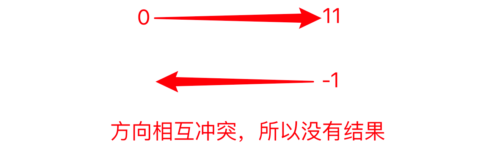

```markdown
title: Strings
date: 2023-12-18 13:40:10
author: Alexa
isOriginal: true
category: 
    - Python
tag:
    - web
    - typora
icon: coding
sticky: false
star: false
article: true
timeline: true
image: false
navbar: true
sidebarIcon: true
headerDepth: 5
comment: true
lastUpdated: true
```

## 1. Definition of Strings

A string is a sequence composed of letters, numbers, and special characters.


## 2. Creating Strings

— Using **<span style="color:orange">single quotes, double quotes</span>, or <span style="color:orange">triple quotes</span>**.

```python
name = "alexa"
number = '18'
paragraph = '''Hello, I'm Alexa
'''
para = """Hello Alexa
"""
```

1. Mixing single and double quotes, so you may need to accept different types of quotes, otherwise, you cannot fully encapsulate the string content.

```python
string = 'I'm Alexa # wrong
string = "I'm Alexa" # correct
```

What about triple quotes?

Let's say we need to store the following text in Python code:

```python
We sometimes need to not only look at the answers within the options but also think about the answers outside the options. — AI Yuechuang

Shallow ones see shallow, deep ones see deep. — Huang Jiabao

The earliest risers are idealists, the fastest runners are scammers, and the bravest are adventurers who are afraid of missing everything and rushing in are leeks. And the real success, may not have entered yet.

Implement the function first, then optimize, otherwise, everything will be chaotic. — AI Yuechuang

Anything you can't write clearly is something you haven't really understood.
```

How do we implement this in Python code as a string?

::: code-tabs

@tab Double quotes

```python
string = "We sometimes need to not only look at the answers within the options but also think about the answers outside the options. — AI Yuechuang

Shallow ones see shallow, deep ones see deep. — Huang Jiabao

The earliest risers are idealists, the fastest runners are scammers, and the bravest are adventurers who are afraid of missing everything and rushing in are leeks. And the real success, may not have entered yet.

Implement the function first, then optimize, otherwise, everything will be chaotic. — AI Yuechuang

Anything you can't write clearly is something you haven't really understood"
# This way, only the first line content will be encapsulated
```

@tab Double quotes + Backslash

```python
string = "We sometimes need to not only look at the answers within the options but also think about the answers outside the options. — AI Yuechuang\

Shallow ones see shallow, deep ones see deep. — Huang Jiabao\

The earliest risers are idealists, the fastest runners are scammers, and the bravest are adventurers who are afraid of missing everything and rushing in are leeks. And the real success, may not have entered yet.\

Implement the function first, then optimize, otherwise, everything will be chaotic. — AI Yuechuang\

Anything you can't write clearly is something you haven't really understood"
# Output
We sometimes need to not only look at the answers within the options but also think about the answers outside the options. — AI YuechuangShallow ones see shallow, deep ones see deep. — Huang JiabaoThe earliest risers are idealists, the fastest runners are scammers, and the bravest are adventurers who are afraid of missing everything and rushing in are leeks. And the real success, may not have entered yet.Implement the function first, then optimize, otherwise, everything will be chaotic. — AI YuechuangAnything you can't write clearly is something you haven't really understood
# Adding a backslash can encapsulate it, but it cannot break the line, so triple quotes are needed.
```

@tab Triple quotes

```python
string = """We sometimes need to not only look at the answers within the options but also think about the answers outside the options. — AI Yuechuang

Shallow ones see shallow, deep ones see deep. — Huang Jiabao

The earliest risers are idealists, the fastest runners are scammers, and the bravest are adventurers who are afraid of missing everything and rushing in are leeks. And the real success, may not have entered yet.

Implement the function first, then optimize, otherwise, everything will be chaotic. — AI Yuechuang

Anything you can't write clearly is something you haven't really understood"""
# Implement the original output
```

:::

Triple quotes can also be used for comments


## 3. String Length

Use `len()`: Returns the length or number of characters in the string, starting from one, including spaces.

```python
para = "Hello, alexa"
print(len(para))

# Output
12
```

## 4. Getting Characters from a String

### 4.1 Getting a Single Character

```python
para = "Hello, alexa"
print(para[2])   # Selecting the 3rd character
print(para[0])   # Selecting the 1st character
print(para[-1])  # Selecting the last character
print(para[len(para)-1])  # Selecting the last character
```

### 4.2 Getting a Range of Characters

Use slicing interval (left-closed right-open) `string[start: end]`

```python
"""Syntax: string = "bornforthis"
select = string[start: end]
PS: Remember to +1 for end"""

para = "Hello, alexa"
print(para[2:6])  # Selecting the 3rd to the 6th character (not including the 7th)
# Output
llo,
```

### 4.3 Getting Multiple Discontinuous Characters

Use slicing interval `string[start: end: sep]`

```python
"""
Syntax: string = "0123456789"
select = string[start: end: sep] *sep= how many steps to the next number*
PS: Remember to +1 for end
"""
string = "0123456789"
# Get characters 02468
select = string[0: len(string): 2]
print(select)
# Get characters 13579
select = string[1: len(string): 2]
print(select)

string = "bornforthis"
# Get characters ofts
select = string[1: len(string): 3]
print(select)
```

### 4.4 Optimization

If we want to extract characters from the beginning to the end, we can omit the start and/or end, leaving them blank.

```python
string = "0123456789"
# Get characters 02468
select = string[::

 2]
print(select)
# Get characters 13579
select = string[1:: 2]
print(select)
```

### 4.5 String Reversal

The third position of the string controls the direction of character extraction. The default is 1 for positive, and if we change it to -1, it will be reversed.

::: warning

Positive and negative control direction, number size controls step size.

:::

```python
string = "bornforthis"
select = string[:: -1]
print(select)

# Output
sihtrofnrob
```

What does the ellipsis omit?

```python
select = string[0:11: -1]
print(select)

# Output
No result
```

If you use a positive index, starting from 0, going to -1 has no value, not satisfied.



If you directly use a positive index to swap positions, the last one is 0, and it will be omitted:

```python
select = string[len(string):0: -1]
print(select)

# Output
sihtrofnro # Missing "b"
```

So it should be reversed from -1 to the last one:


```python
select = string[-1:-1*len(string)-1: -1]
print(select)
```

```python
# Get rofn
select = string[-5:-9: -1]
print(select)
```

## 5. String Built-in Methods

### 5.1 .upper()

Converts the entire string to uppercase.

```python
string = "bornforthis"
print(string.upper())

# Output
BORNFORTHIS
```

### 5.2 .lower()

Converts the entire string to lowercase.

```python
string = "BORNFORTHIS"
print(string.lower())

# Output
bornforthis
```

### 5.3 .capitalize()

Capitalizes the first letter of the string.

```python
string = "BORNFORTHIS"
print(string.capitalize())

# Output
Bornforthis
```

### 5.4 .title()

Capitalizes the first letter of each word, creating a title format.

```python
string = "BORNFORTHIS to-aiyc"
print(string.title())

# Output
Bornforthis To-Aiyc
```

### 5.5 .startswith()

Checks if the string starts with a specific content, returns True or False.

```python
string = "BORNFORTHIS to-aiyc"
print(string.startswith("b"))

# Output
False

string = "BORNFORTHIS to-aiyc"
print(string.startswith("BO"))

# Output
True
```

### 5.6 .endswith()

Checks if the string ends with a specific character or word, returns a boolean value.

```python
string = "BORNFORTHIS to-aiyc"
print(string.endswith("BO"))
# Output
False

string = "BORNFORTHIS to-aiyc"
print(string.endswith("yc"))
# Output
True
```

### 5.7 .count()

Counts the number of times a specific character or word appears in the target string.

```python
string = "BORNFORTHIS to-aiyc bornforthis"
print(string.count("i"))
# Output
2 # Case-sensitive

string = "BORNFORTHIS for-aiyc bornforthis"
print(string.count("for"))
# Output
2
```

### 5.8 .find()

Finds the index of the first occurrence of a specific character or word in the string. If searching for a word, `find()` returns the index of the first character of the target word. If the character or word is not found, it returns -1.

```python
string = "BORNFORTHIS for-aiyc bornforthis"
print(string.find("for"))

# Output
12 # Returns the index of the first occurrence

string = "BORNFORTHIS for-aiyc bornforthis"
print(string.find("R"))

# Output
2

string = "BORNFORTHIS for-aiyc bornforthis"
print(string.find("k"))

# Output
-1
```

### 5.9 .index()

Finds the index of the first occurrence of a specific character or word in the string. If searching for a word, `index()` returns the index of the first character of the target word. If the character or word is not found, it raises an error.

```python
string = "BORNFORTHIS for-aiyc bornforthis"
print(string.index("k"))

# Output
ValueError: substring not found
```

### 5.10 .isdigit()

Checks if the string is a pure numeric string. Returns False if any character in the string is not a number.

```python
string = "01234567"
print(string.isdigit())

# Output
True

string = "01234567o"
print(string.isdigit())

# Output
False
```

### 5.11 .isalpha()

Checks if the string is a pure alphabetical string. Returns False if any character in the string is not a letter.

```python
string = "abcdefg"
print(string.isalpha())

# Output
True

string = "abcdefg0"
print(string.isalpha())

# Output
False
```

Sure, here is the translation of the provided Markdown content to English:

```markdown
## 5.12 .isalnum()

Checks whether the string consists of alphanumeric characters only. Returns False if the string contains any non-alphanumeric elements.

```python
string = "abcdefg0"
print(string.isalnum())

# output
True

string = "abcdefg0!"
print(string.isalnum())

# output
False
```

## 5.13 .isupper()

Checks if all the letters in the string are uppercase. Returns True if all uppercase, otherwise False.

```python
string = "abcdefg0!"
print(string.isupper())

# output
False
```

## 5.14 .islower()

Checks if all the letters in the string are lowercase. Returns True if all lowercase, otherwise False.

```python
string = "abcdefg0!"
print(string.islower())

# output
True
```

## 5.15 .isspace()

Checks if the string consists of only whitespace characters. Returns True for pure whitespace, otherwise False.

```python
string = "abcdefg0!"
print(string.isspace())

# output
False

string = "   "
print(string.isspace())

# output
True
```

## 5.16 .strip()

By default, removes leading and trailing whitespace characters from the target string. If specified, it can also remove specified characters.

```python
string = "   bornforthis   "
print(string.strip())  # Removes leading and trailing spaces
# output
bornforthis

string = "---bornforthis---"
print(string.strip("-"))  # Removes leading and trailing hyphens
# output
bornforthis

string = "--  -bornforthis-- -"
print(string.strip("-"))  # Removes consecutive hyphens only from both ends until a different character is encountered
# output
  -bornforthis-- 
    
string = "--  -bornforthis-- -"
print(string.strip("- "))  # Removes all hyphens and spaces from both ends simultaneously
# output
bornforthis
```

## 5.17 .lstrip()

By default, removes leading whitespace characters from the string. If specified, it can remove specified leading characters.

```python
string = "--  -bornforthis-- -"
print(string.lstrip("- "))
# output
bornforthis-- -
```

## 5.18 .rstrip()

By default, removes trailing whitespace characters from the string. If specified, it can remove specified trailing characters.

```python
string = "--  -bornforthis-- -"
print(string.rstrip("- "))
# output
--  -bornforthis
```

## 5.19 .replace()

`.replace(old, new, count)` replaces occurrences of the "old" character with the "new" character. The count parameter controls the number of replacements.

```python
string = "--  -bornforthis-- -"
string1 = string.replace(" ","*")  # Replaces all spaces with *
string2 = string.replace("-", "!", 3)  # Replaces the first three hyphens with !
print(string, string1, string2, sep="\n")

# output
--  -bornforthis-- -
--**-bornforthis--*-
!!  !bornforthis-- -
```

## 5.20 .split()

`.split(sep, maxsplit)` splits the string using a specific character, default is space. If the "sep" parameter is provided, it splits using that character and returns a list. The maxsplit parameter controls how many splits to perform, default is to split from the left.

```python
string = "i am bornforthis bornforthis"
lst1 = string.split()
lst2 = string.split("o")
lst3 = string.split("o", 3)
print(string, lst1, lst2, lst3, sep="\n")

# output
i am bornforthis bornforthis
['i', 'am', 'bornforthis', 'bornforthis']
['i am b', 'rnf', 'rthis b', 'rnf', 'rthis']
['i am b', 'rnf', 'rthis b', 'rnforthis']
```

## 5.21 .rsplit()

`.rsplit(sep, maxsplit)` splits the string from the right, using a specific character if provided. Returns a list. The maxsplit parameter controls how many splits to perform.

```python
string = "i am bornforthis bornforthis"
lst1 = string.rsplit()
lst2 = string.rsplit("o")
lst3 = string.rsplit("o", 3)
print(string, lst1, lst2, lst3, sep="\n")

# output
i am bornforthis bornforthis
['i', 'am', 'bornforthis', 'bornforthis']
['i am b', 'rnf', 'rthis b', 'rnf', 'rthis']
['i am bornf', 'rthis b', 'rnf', 'rthis']
```

## 5.22 .join()

Joins the characters of a string with a specific separator. `“sep”.join(string)`

```python
string = "i am bornforthis "
string_joined = "-".join(string)
print(string_joined)

# output
i- -a-m- -b-o-r-n-f-o-r-t-h-i-s- 
```

## 6. String Formatting

Issue:

```python
string = "Hi Bornforthis,Welcome to XiaMen."
print(string)

# ---output---
Hi Bornforthis,Welcome to XiaMen.
```

- The problem is that each time we want to change a name or location, we need to create a new string.
- Using string concatenation may be cumbersome, especially for more complex strings.
- Another issue is that different data types cannot be directly concatenated in Python, unless explicitly converted to strings:

```python
string = "Money is " + 190
print(string)

# ---output---
Traceback (most recent call last):
  File "/Users/huangjiabao/GitHub/iMac/Pycharm/StudentCoder/40-YEWENTE/demo1.py", line 1, in <module>
    string = "Money is " + 190
TypeError: can only concatenate str (not "int") to str


string = "Money is " + str(190)
print(string)
# ---output---
Money is 190
```

To address these issues, the **format** method is introduced.