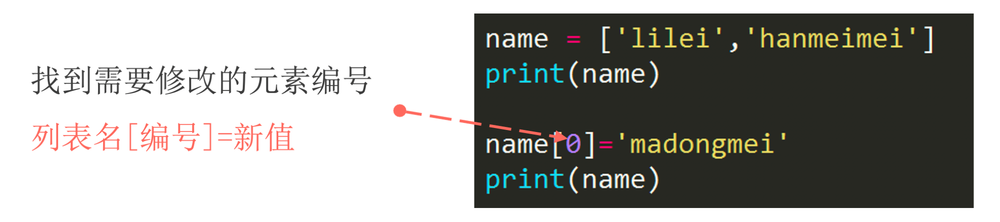
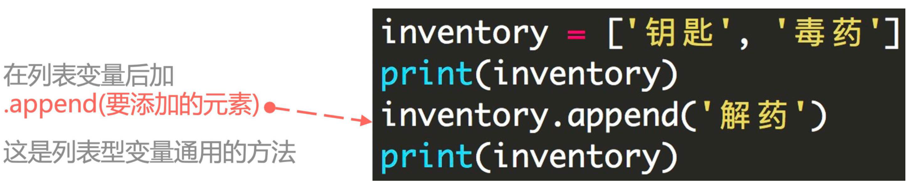
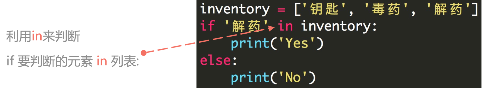
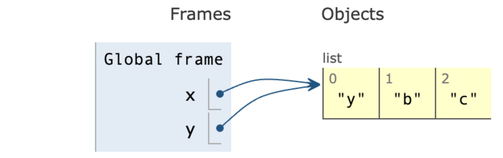
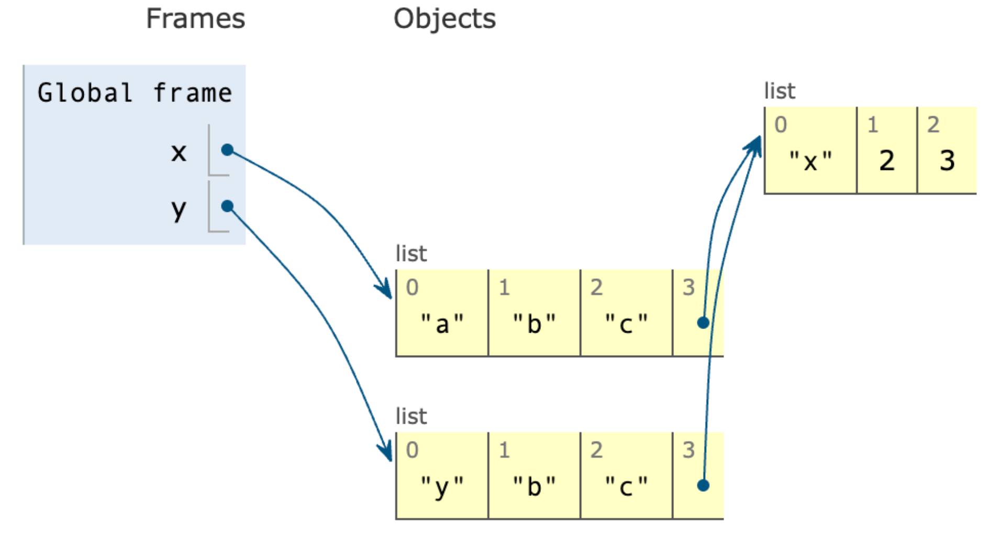
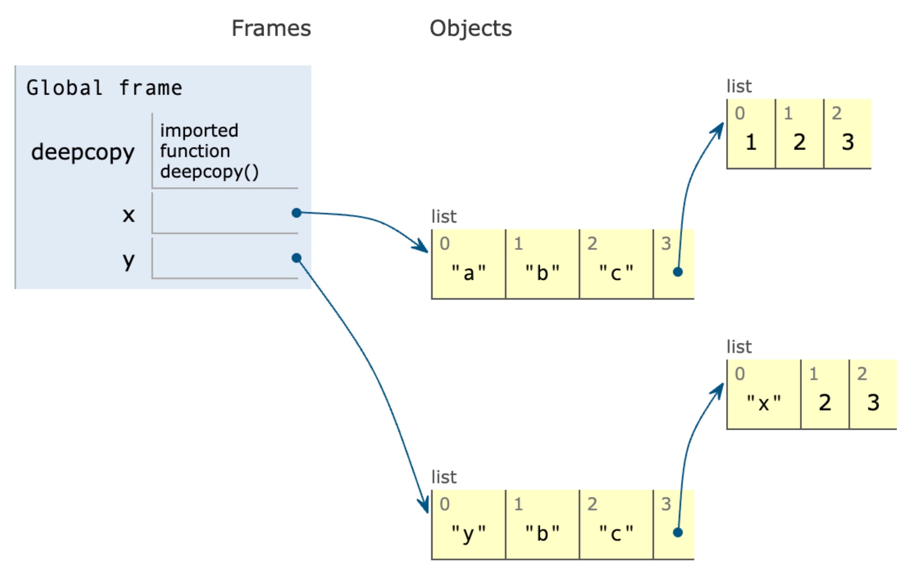

## 1. List Structure

- Use **<span style="color:orange">square brackets</span>** to represent lists.
- Elements inside the list are separated by **<span style="color:orange">commas</span>**.
- Note that it is in the **<span style="color:orange">English input method</span>**.

```python
student1 = ['lilei', 18, 'class01', 201901]
student2 = ['hanmeimei', 19, 'class02', 201902]
```

The **<span style="color:orange">mutability</span>** of a list: you can modify the content inside the list.

- Convert a string to a list

```python
string_to_list = list("Bornforthis")
print(string_to_list)

# output
['B', 'o', 'r', 'n', 'f', 'o', 'r', 't', 'h', 'i', 's']
```

## 2. Accessing Elements in a List

### 2.1 Composition of List Indices

In programming languages, **<span style="color:orange">the first position is usually numbered 0</span>**.


### 2.2 Extracting a Single Element

The number inside the square brackets specifies the element's position.

```python
grade = [98, 99, 95, 80]
print(grade[0])  # 98
print(grade[0] + grade[3])  # 178
```

### 2.3 Getting a Range of Elements in a List


- Inside the square brackets, use **<span style="color:orange">start_position:end_position</span>**.
- **Note:** It does not include the element at the end position.

```python
numbers = [0, 1, 2, 3, 4, 5, 6, 7, 8, 9]
print(numbers[2:6])  # [2, 3, 4, 5]
```

### 2.4 Getting Elements with a Specific Interval in a List


```python
numbers = [0, 1, 2, 3, 4, 5, 6, 7, 8, 9]
print(numbers[1:7:2])  # [1, 3, 5]
```

```python
grade = [98, 99, 95, 80]
print(grade[1])
print(grade[0], grade[2])
print(grade[0:4]) # The third position defaults to +1, so it must be changed to -1 when reversed
print(grade[-1:-4:-1]) # Reverse the list
```

## 3. List Slicing Assignment

:::tab

@tab Code


@tab Think


:::

```python
In [1]: name = list('Python')

In [2]: name
Out[2]: ['P', 'y', 't', 'h', 'o', 'n']

In [3]: name[2:]
Out[3]: ['t', 'h', 'o', 'n']

In [4]: list('abc')
Out[4]: ['a', 'b', 'c']

In [5]: name[2:]=list('abc')

In [6]: name
Out[6]: ['P', 'y', 'a', 'b', 'c']
```


```python
In [7]: numbers = [1, 5]

In [8]: numbers[1:1]
Out[8]: [] # Cannot access 5

In [9]: numbers[1:1] = [2, 3, 4]

In [10]: numbers
Out[10]: [1, 2, 3, 4, 5]

In [11]: numbers[1:4] = []

In [12]: numbers
Out[12]: [1, 5]
```

## 4. Trying It Out

Get user input for two values: one is the position to insert, and the other is the value to be inserted at that position.

Given the following list:

```python
numbers = [1, 2, 3, 5, 6]
```

**Example:**

```python
Enter position: 3
Enter value: 4
[1, 2, 3, 4, 5, 6]
```

::: code-tabs

@tab code1

```python
numbers = [1, 2, 3, 5, 6]
end = len(numbers)
position = int(input(f"Enter position (enter a value from 0 to {end}):>>> "))
value = int(input("Enter value:>>> "))
numbers[position: position] = [value]
print(numbers)
```

@tab code2

```python
numbers = [1, 2, 3, 5, 6]
end = len(numbers)
position = int(input(f"Enter position (enter a value from 0 to {end}):>>> "))
value = int(input("Enter value:>>> "))
result = numbers[:position] + [value] + numbers[position:]
print(result)
```

:::

## 5. Inserting Elements at a Specific Position - `.insert(index, element)`

`.insert(index, element)` is a basic method for lists, used to insert an element at a specified position.

Its basic syntax is:

```python
list.insert(index, element)
```

- `index`: Specifies the position to insert the element. The index starts from 0. If the specified index is beyond the current length of the list (no error will be raised), the element will be added to the end of the list.
- `element`: This is the element you want to insert into the list.

```python
numbers = [1, 2, 3, 5, 6]
numbers.insert(3, 4)
print(numbers)

# output
[1, 2, 3, 4, 5, 6]
```

## 6. List Length

To get the length of a list, use `len()`:

```python
numbers = [1, 2, 3, 5, 6]
print(len(numbers))

# output
5
```

## 7. Modifying Elements in a List



1. Modifying a Single Element

```python
numbers = [1, 2, 3, 5, 6]
print("before:", numbers)
numbers[0] = "xxx"
print("after:", numbers)

# output
before: [1, 2, 3, 5, 6]
after: ['xxx', 2, 3, 5, 6]
```

2. Modifying Multiple Elements

::: code-tabs

@tab Same number of elements

```python
numbers = [1, 2, 3, 5, 6]
print("before:", numbers)
numbers[0:3] = ["xxx", "yyy", "zzz"]
print("after:", numbers)

# output
before: [1, 2, 3, 5, 6]
after: ['xxx', 'yyy', 'zzz', 5, 6]
```

@tab Different number of elements

```python
numbers = [1, 2, 3, 5, 6]
print("before:", numbers)
numbers[0:5] = ["xxx", "yyy"]
print("after:", numbers)

# output
before: [1, 2, 3, 5, 6]
after: ['xxx', 'yyy']
```

:::

3. Multiple modifications with a string

```python
numbers = [1, 2, 3, 5, 6]
print("before:", numbers)
numbers[0:3] = 'bornforthis'
print("after:", numbers)

# output
before: [1, 2, 3, 5, 6]
after: ['b', 'o', 'r', 'n', 'f', 'o', 'r', 't', 'h', 'i', 's', 5, 6]
```

- Objects that can be used for multiple element modification:
    - List
    - Tuple
    - Set
    - String
    - Dictionary (with keys)

```python
numbers = [1, 2, 3, 5, 6]
print("before:", numbers)
numbers[0:3] = {"a": 1, "b": 8}
print("after:", numbers)

# output
before: [1, 2, 3, 5, 6]
after: ['a', 'b', 5, 6]
```

- Objects not allowed for multiple element modification:
    - Boolean

```python
numbers = [1, 2, 3, 5, 6]
print("before:", numbers)
numbers[0:3] = True
print("after:", numbers)

# output
before: [1, 2, 3, 5, 6]
Traceback (most recent call last):
  File "/Users/gaxa/Coder/Pythonfile/data_type.py", line 3, in <module>
    numbers[0:3] = True
    ~~~~~~~^^^^^
TypeError: can only assign an iterable
```

## 8. Adding Elements to a List

### 8.1 Adding a Single Element - `.append()`



```python
numbers = [1, 2, 3, 5, 6]
print("before:", numbers)
numbers.append("aaa")
print("after:", numbers)

# output
before: [1, 2, 3, 5, 6]
after: [1, 2, 3, 5, 6, 'aaa']

numbers = [1, 2, 3, 5, 6]
print("before:", numbers)
numbers.append(["aaa", "bbb"])
print("after:", numbers)
# output
before: [1, 2, 3, 5, 6]
after: [1, 2, 3, 5, 6, ['aaa', 'bbb']]
# It will put the entire list inside; does not support adding multiple elements
```

### 8.2 Adding Multiple Elements

```python
numbers = [1, 2, 3, 5, 6]
print("before:", numbers)
numbers.extend(["aaa", "bbb"])
print("after:", numbers)

# output
before: [1, 2, 3, 5, 6]
after: [1, 2, 3, 5, 6, 'aaa', 'bbb']
```

## 9. Deleting Elements from a List

### 9.1 `del`

`del` is used to specify individual or multiple elements to be deleted from the list.

```python
numbers = [1, 2, 3, 5, 6]
print("before:", numbers)
del numbers[2]
print("after:", numbers)

# output
before: [1, 2, 3, 5, 6]
after: [1, 2, 5, 6]
```

If not specifying elements to delete, it will delete the entire variable.

```python
numbers = [1, 2, 3, 5, 6]
print("before:", numbers)
del numbers
print("after:", numbers)

# output
Traceback (most recent call last):
  File "/Users/gaxa/Coder/Pythonfile/data_type.py", line 4, in <module>
    print("after:", numbers)
                    ^^^^^^^
NameError: name 'numbers' is not defined
before: [1, 2, 3, 5, 6]
```

### 9.2 `pop()`

`pop()` function by default deletes the last element from the list, and it can also take an argument to specify the index of the element to be removed.

```python
numbers = [1, 2, 3, 5, 6]
print("before:", numbers)
numbers.pop()
print("after:", numbers)

# output
before: [1, 2, 3, 5, 6]
after: [1, 2, 3, 5]

numbers = [1, 2, 3, 5, 6]
print("before:", numbers)
numbers.pop(0)
print("after:", numbers)

# output
before: [1, 2, 3, 5, 6]
after: [2, 3, 5, 6]
```

### 9.3 `remove()`

`remove()` is used to specify the removal of a particular element from the list. For example, `remove('aiyc')` specifies the removal of the `'aiyc'` element from the list.

If there are duplicates, only one instance will be removed.

```python
numbers = [1, 2, 3, 5, 6]
print("before:", numbers)
numbers.remove(2) # element 2 not the 3rd element
print("after:", numbers)

# output
before: [1, 2, 3, 5, 6]
after: [1, 3, 5, 6]
```


## 10. Combining Two Lists

Simply use the plus sign.

```python
numbers1 = [1, 2, 3, 5, 6]
numbers2 = [10, 20, 30]
print(numbers1 + numbers2)

# output
[1, 2, 3, 5, 6, 10, 20, 30]
```


## 11. Checking if an Element Exists in a List - `Value in Sequence`



```python
numbers = [1, 2, 3, 5, 6]
print(1 in numbers)
print(10 in numbers)

# output
True
False
```


## 12. Getting the Repeat Count of an Element in a List - `.count()`

```python
numbers = [1, 2, 1, 1, 3, 5, 6]
print(numbers.count(1))

# output
3
```

## 13. Get the First Occurrence Position of an Element in a List - `.index()`

Use **<span style="color:orange">list.index(element)</span>** to obtain the position. If the element is not in the list, an error will be raised.

```python
numbers = [1, 2, 1, 1, 3, 5, 6]
print(numbers.index(1))

# Output
0
```


## 14. Sorting a List

### 14.1 `sort(reverse=False)`

`list.sort()` arranges elements in the list in ascending order and modifies the list directly. If `reverse=True` is specified, the list is sorted in descending order.

```python
numbers = [1, 2, 1, 1, 3, 5, 6]
numbers.sort()
print(numbers)
numbers.sort(reverse=True)
print(numbers)

# Output
[1, 1, 1, 2, 3, 5, 6]
[6, 5, 3, 2, 1, 1, 1]
```

### 14.2 `sorted(list, reverse=False)`

`sorted(list, reverse=False)` sorts the list in ascending order, leaving the original list unchanged and returning a new list. `reverse` is set to False by default, and if set to True, it returns the list in descending order.

::: code-tabs

@tab default

```python
numbers = [1, 2, 1, 1, 3, 5, 6]
new_numbers = sorted(numbers)
print(new_numbers)

# Output
[1, 1, 1, 2, 3, 5, 6]
```

@ tab reverse=True

```python
numbers = [1, 2, 1, 1, 3, 5, 6]
new_numbers = sorted(numbers, reverse=True)
print(new_numbers)

# Output
[6, 5, 3, 2, 1, 1, 1]
```

### 14.3 Practice

- Convert the string '132569874' to a list and output it.
- Sort the elements at even indices (0/2/4/6/8) in descending order without changing the elements at odd indices.

```python
numbers = list("132569874")
print(numbers)
lst = sorted(numbers[::2], reverse=True)
numbers[::2] = lst
print(numbers)
# Output
['1', '3', '2', '5', '6', '9', '8', '7', '4']
['8', '3', '6', '5', '4', '9', '2', '7', '1']
```

```python
numbers = list("132569874")
print(numbers)
even_positions = numbers[::2]
even_positions.sort(reverse=True)
numbers[::2] = even_positions
print(numbers)
```

## 15. `reverse()`

Reverse the elements in a list = [::-1]

```python
numbers = list("132569874")
print(numbers)
numbers.reverse()
print(numbers)

# Output
['1', '3', '2', '5', '6', '9', '8', '7', '4']
['4', '7', '8', '9', '6', '5', '2', '3', '1']
```

## 16. List Copy - Shallow and Deep Copies

### 16.1 Existing Issue

```python
x = ['a', 'b', 'c']
y = x
print(f'original:\n\tx:{x}\n\ty:{y}\n\tid_x:{id(x)}')
y[0] = 'y'
print(f'after:\n\tx:{x}\n\ty:{y}\n\tid_y:{id(y)}')
# id is used to check the physical address of variables (their location in the computer)
# Global perspective

# Output
original:
	x:['a', 'b', 'c']
	y:['a', 'b', 'c']
	id_x:4518098176
after:
	x:['y', 'b', 'c']
	y:['y', 'b', 'c']
	id_y:4518098176
```

We observe that modifying `y` also affects `x`. Why does this happen?

This is because, during the assignment `y = x`, only the address of the list is assigned, and `x` and `y` actually point to the same list.

1. Proof 1: Python id is used to check the physical address (location in the computer)

From the above code result: `x` and `y` point to the same list, as their `id` values are the same.

2. Proof 2: Visual check



How to solve this issue - `copy()`

### 16.2 `.copy()`

`x` and `y` have different `id` values

```python
x = ['a', 'b', 'c']
y = x.copy()
print(f'original:\n\tx:{x}\n\ty:{y}\n\tid_x:{id(x)}')
y[0] = 'y'
print(f'after:\n\tx:{x}\n\ty:{y}\n\tid_y:{id(y)}')

# Output
original:
	x:['a', 'b', 'c']
	y:['a', 'b', 'c']
	id_x:4543512448
after:
	x:['a', 'b', 'c']
	y:['y', 'b', 'c']
	id_y:4543533056   
```

### 16.3 Issue with `copy()` - Shallow Copy

```python
x = ['a', 'b', 'c', [1, 2, 3]]
y = x.copy()
print(f'original:\n\tx:{x}\n\ty:{y}\n\tid_x:{id(x)}\n\tid_y:{id(y)}\n\tid_children x[3]:{id(x[3])}\n\tid_children y[3]:{id(y[3])}')
y[0] = 'y'
print(f'after1:\n\tx:{x}\n\ty:{y}\n\tid_x:{id(x)}\n\tid_y:{id(y)}\n\tid_children x[3]:{id(x[3])}\n\tid_children y[3]:{id(y[3])}')
y[3][0] = 'x'
print(f'after2:\n\tx:{x}\n\ty:{y}\n\tid_x

:{id(x)}\n\tid_y:{id(y)}\n\tid_children x[3]:{id(x[3])}\n\tid_children y[3]:{id(y[3])}')

# Output

original:
	x:['a', 'b', 'c', [1, 2, 3]]
	y:['a', 'b', 'c', [1, 2, 3]]
	id_x:4655604992
	id_y:4655604864
	id_children x[3]:4655600832
	id_children y[3]:4655600832
after1: # Proof that modifying y does not affect x because x and y have different ids
	x:['a', 'b', 'c', [1, 2, 3]]
	y:['y', 'b', 'c', [1, 2, 3]]
	id_x:4655604992
	id_y:4655604864
	id_children x[3]:4655600832
	id_children y[3]:4655600832
after2: # Proof that modifying the sublist in y affects x because the ids of the sublist in x and y are the same
	x:['a', 'b', 'c', ['x', 2, 3]]
	y:['y', 'b', 'c', ['x', 2, 3]]
	id_x:4655604992
	id_y:4655604864
	id_children x[3]:4655600832
	id_children y[3]:4655600832
```

1. Proof 1: From the above code, it's observed that the ids of the sublists are the same, indicating that the sublist in `x` and `y` is the same list.
2. Proof 2: Visual check.



So, `copy()` performs a shallow copy, copying only the first layer, and nested lists are not copied.

### 16.4 `deepcopy()`

Import the library to use deep copy.

```python
from copy import deepcopy
```

```python
from copy import deepcopy
x = ['a', 'b', 'c', [1, 2, 3]]
y = deepcopy(x)
print(f'original:\n\tx:{x}\n\ty:{y}\n\tid_x:{id(x)}\n\tid_y:{id(y)}\n\tid_children x[3]:{id(x[3])}\n\tid_children y[3]:{id(y[3])}')
y[0] = 'y'
print(f'after1:\n\tx:{x}\n\ty:{y}\n\tid_x:{id(x)}\n\tid_y:{id(y)}\n\tid_children x[3]:{id(x[3])}\n\tid_children y[3]:{id(y[3])}')
y[3][0] = 'x'
print(f'after2:\n\tx:{x}\n\ty:{y}\n\tid_x:{id(x)}\n\tid_y:{id(y)}\n\tid_children x[3]:{id(x[3])}\n\tid_children y[3]:{id(y[3])}')

# Output

original:
	x:['a', 'b', 'c', [1, 2, 3]]
	y:['a', 'b', 'c', [1, 2, 3]]
	id_x:5009087680
	id_y:5009087552
	id_children x[3]:5009083584
	id_children y[3]:5009087616
after1:
	x:['a', 'b', 'c', [1, 2, 3]]
	y:['y', 'b', 'c', [1, 2, 3]]
	id_x:5009087680
	id_y:5009087552
	id_children x[3]:5009083584
	id_children y[3]:5009087616
after2:
	x:['a', 'b', 'c', [1, 2, 3]]
	y:['y', 'b', 'c', ['x', 2, 3]]
	id_x:5009087680
	id_y:5009087552
	id_children x[3]:5009083584
	id_children y[3]:5009087616
```

1. After using `deepcopy`, the ids of the sublists are different, indicating that they are distinct lists, so modifying `y` does not affect `x`.
2. Visual check.



### 16.5 A Special Case

While discussing list copying, in the case of shallow copying, although the sublist is not entirely copied, there is a scenario where modifications to the sublist will not affect each other.

In other words, in the shallow copy code, when does modifying the sublist not affect each other?

```python
x = ['a', 'b', 'c', [1, 2, 3]]
y = x.copy()
print(f'original:\n\tx:{x}\n\ty:{y}\n\tid_x:{id(x)}\n\tid_y:{id(y)}\n\tid_children x[3]:{id(x[3])}\n\tid_children y[3]:{id(y[3])}')
y[0] = 'y'
print(f'after1:\n\tx:{x}\n\ty:{y}\n\tid_x:{id(x)}\n\tid_y:{id(y)}\n\tid_children x[3]:{id(x[3])}\n\tid_children y[3]:{id(y[3])}')

# Directly modify y[3] to a new list, rather than modifying y[3][0]
y[3] = ['x', 2, 3]
print(f'after2:\n\tx:{x}\n\ty:{y}\n\tid_x:{id(x)}\n\tid_y:{id(y)}\n\tid_children x[3]:{id(x[3])}\n\tid_children y[3]:{id(y[3])}')

# Output
original:
	x:['a', 'b', 'c', [1, 2, 3]]
	y:['a', 'b', 'c', [1, 2, 3]]
	id_x:4674361856
	id_y:4674361728
	id_children x[3]:4674357824
	id_children y[3]:4674357824
after1:
	x:['a', 'b', 'c', [1, 2, 3]]
	y:['y', 'b', 'c

', [1, 2, 3]]
	id_x:4674361856
	id_y:4674361728
	id_children x[3]:4674357824
	id_children y[3]:4674357824
after2:
	x:['a', 'b', 'c', [1, 2, 3]]
	y:['y', 'b', 'c', ['x', 2, 3]]
	id_x:4674361856
	id_y:4674361728
	id_children x[3]:4674357824
	id_children y[3]:4674361792
```
