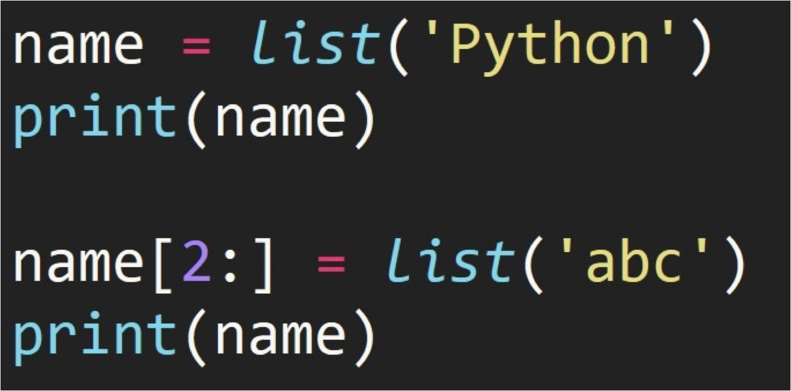
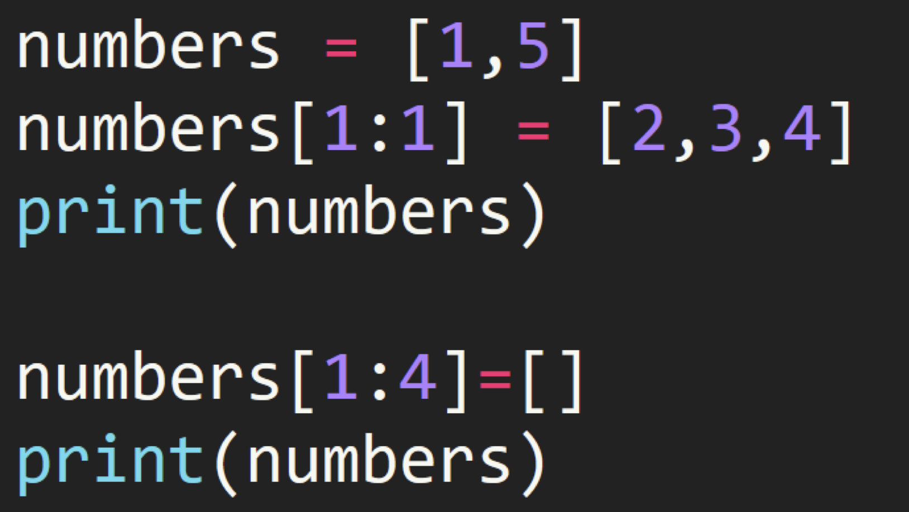

## 1. List Structure

- Use **<span style="color:orange">square brackets</span>** to represent lists.
- Elements inside the list are separated by **<span style="color:orange">commas</span>**.
- Note that it is in the **<span style="color:orange">English input method</span>**.

```python
student1 = ['lilei', 18, 'class01', 201901]
student2 = ['hanmeimei', 19, 'class02', 201902]
```

The **<span style="color:orange">mutability</span>** of a list: you can modify the content inside the list.

- Convert a string to a list

```python
string_to_list = list("Bornforthis")
print(string_to_list)

# output
['B', 'o', 'r', 'n', 'f', 'o', 'r', 't', 'h', 'i', 's']
```

## 2. Accessing Elements in a List

### 2.1 Composition of List Indices

In programming languages, **<span style="color:orange">the first position is usually numbered 0</span>**.


### 2.2 Extracting a Single Element

The number inside the square brackets specifies the element's position.

```python
grade = [98, 99, 95, 80]
print(grade[0])  # 98
print(grade[0] + grade[3])  # 178
```

### 2.3 Getting a Range of Elements in a List


- Inside the square brackets, use **<span style="color:orange">start_position:end_position</span>**.
- **Note:** It does not include the element at the end position.

```python
numbers = [0, 1, 2, 3, 4, 5, 6, 7, 8, 9]
print(numbers[2:6])  # [2, 3, 4, 5]
```

### 2.4 Getting Elements with a Specific Interval in a List


```python
numbers = [0, 1, 2, 3, 4, 5, 6, 7, 8, 9]
print(numbers[1:7:2])  # [1, 3, 5]
```

```python
grade = [98, 99, 95, 80]
print(grade[1])
print(grade[0], grade[2])
print(grade[0:4]) # The third position defaults to +1, so it must be changed to -1 when reversed
print(grade[-1:-4:-1]) # Reverse the list
```

## 3. List Slicing Assignment

:::tab

@tab Code



@tab Think


:::

```python
In [1]: name = list('Python')

In [2]: name
Out[2]: ['P', 'y', 't', 'h', 'o', 'n']

In [3]: name[2:]
Out[3]: ['t', 'h', 'o', 'n']

In [4]: list('abc')
Out[4]: ['a', 'b', 'c']

In [5]: name[2:]=list('abc')

In [6]: name
Out[6]: ['P', 'y', 'a', 'b', 'c']
```



```python
In [7]: numbers = [1, 5]

In [8]: numbers[1:1]
Out[8]: [] # Cannot access 5

In [9]: numbers[1:1] = [2, 3, 4]

In [10]: numbers
Out[10]: [1, 2, 3, 4, 5]

In [11]: numbers[1:4] = []

In [12]: numbers
Out[12]: [1, 5]
```

## 4. Trying it Out

Get user input for two values, one is the position to insert, and the other is the value to insert at that position.

Given the following list:

```python
numbers = [1, 2, 3, 5, 6]
```

**Example:**

```python
Enter position: 3
Enter value: 4
[1, 2, 3, 4, 5, 6]
```

```python
numbers = [1, 2, 3, 5, 6]
end = len(numbers)
position = int(input(f"Enter position (enter a value from 0 to {end}):>>> "))
value = int(input("Enter value:>>> "))
numbers[position: position] = [value]
print(numbers)
```
