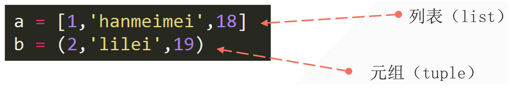

## 1. Creating a Tuple

- Use parentheses to create a tuple.
- Separate elements with commas.

```python
tup = (2, "x", "y")
print(tup, type(tup))

# output
(2, 'x', 'y') <class 'tuple'>
```

## 2. Comparing Lists and Tuples



Differences between lists and tuples:

- Lists use square brackets `[]` to enclose elements, while tuples use round brackets `()`.
- Elements in lists can be modified, added, or removed (mutable), while elements in tuples cannot be modified (immutable).

## 3. Immutability of Tuples

Any attempt to modify a tuple will result in an error:

```python
tup = (2, "x", "y")
tup[0] = 1

# output
Traceback (most recent call last):
  File "/Users/gaxa/Coder/Pythonfile/data_type.py", line 2, in <module>
    tup[0] = 1
    ~~~^^^
TypeError: 'tuple' object does not support item assignment
```

## 4. Indexing and Slicing Tuples

```python
tup = (2, "lilei", 19)
print(tup[1])        # output 2
print(tup[0], tup[2]) # output 2 19
print(tup[::2])       # output (2, 19)
print(tup[-2:-4:-1])  # output ("lilei", 2)
```

## 5. Tuple Characteristics

Consider the scenario where a tuple has only one element. What type is it?

```python
tup = (1)
print(type(tup))

# output
<class 'int'>
```

To resolve this issue, add a comma:

```python
tup = (1,)  # Add a comma to distinguish when a tuple has only one element
print(type(tup))

# output
<class 'tuple'>
```

## 6. Concatenating Tuples

Simply use the plus sign to concatenate tuples:

```python
tup1 = (1, 2, 3)
tup2 = (4, 5, 6)
new_tup = tup1 + tup2
print(new_tup)

# output
(1, 2, 3, 4, 5, 6)
```

## 7. Sorting Tuples

### 7.1 Using Basic Knowledge

Sort the following tuple:

```python
tup = (9, 7, 5, 3, 1, 2, 4, 6, 8, 0)
```

Approach:

- Convert the tuple to a list since tuples are immutable.
- Perform sorting.
- Convert it back to a tuple.

```python
tup = (9, 7, 5, 3, 1, 2, 4, 6, 8, 0)
lst = list(tup)
lst.sort()            # Modify the list directly
tup_new = tuple(lst)
print(tup_new)

# output
(0, 1, 2, 3, 4, 5, 6, 7, 8, 9)
```

### 7.2 Using `sorted()`

`sorted()` essentially performs the same steps:

```python
tup1 = tuple(sorted(tup))  # sorted(tup) automatically converts it to a list, so it needs to be converted back to a tuple
print(tup1)

# output
(0, 1, 2, 3, 4, 5, 6, 7, 8, 9)
```

## 8. Using `zip()`

### 8.1 Introduction

`zip()` is a built-in function that pairs corresponding elements from multiple iterable objects (such as lists, tuples, or strings) and returns an iterator of tuples. If you have two or more lists and want to create an iterator based on their corresponding elements, `zip()` is useful.

1. For example, with two lists:

```python
list1 = [1, 2, 3]
list2 = ['a', 'b', 'c']
zipped = zip(list1, list2)
```

Now `zipped` is an iterator containing tuples where each tuple consists of corresponding elements from both lists. You can convert it to a list to view the contents:

```python
list(zipped)

# output
[(1, 'a'), (2, 'b'), (3, 'c')]
```

You can iterate through this iterator using a loop:

```python
for num, letter in zipped:
    print(f'Number: {num}, Letter: {letter}')

# output
Number: 1, Letter: a
Number: 2, Letter: b
Number: 3, Letter: c
```

2. The same applies to tuples:

```python
tup1 = (1, 2, 3)
tup2 = ('a', 'b', 'c')
zipped = zip(tup1, tup2)
list(zipped)

# ---output---
[(1, 'a'), (2, 'b'), (3, 'c')]
```
