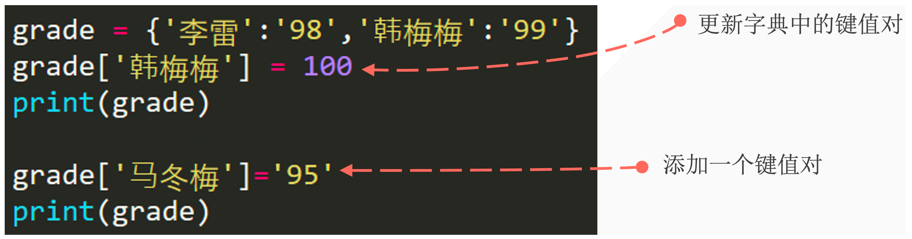
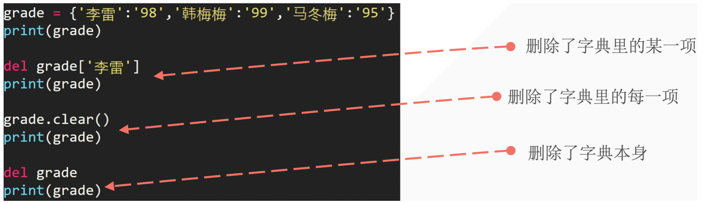
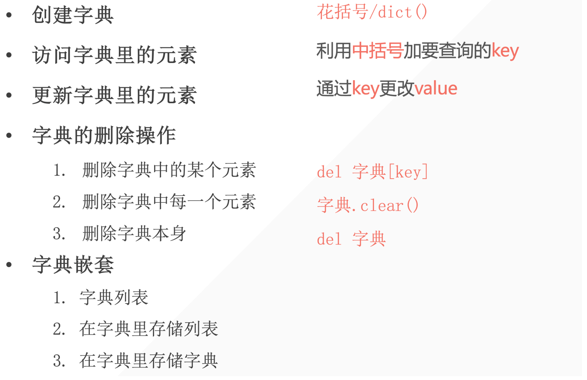

## 1. How to Create a Phone Book

Suppose we have the following contacts:

| Name        | Phone Number |
| ----------- | ------------ |
| 李雷        | 123456       |
| 韩梅梅      | 132456       |
| 大卫        | 154389       |
| Mr.Liu      | 131452       |
| Bornforthis | 180595       |
| Alexa       | 131559       |

How to build a phone book with user input search functionality using the knowledge we've learned so far.

> Variables, numeric types, lists, tuples, strings.

Program output:

- Test 1:

```python
Enter your search name: 李雷
The 李雷 phone number is: 123456
```

- Test 2:

```python
Enter your search name: Bornforthis
The Bornforthis phone number is: 180595
```

::: code-tabs

@tab method 1

```python
contacts = ['李雷', 123456, '韩梅梅', 132456, '大卫', 154389, 'Mr. Liu', 131452, 'Bornforthis', 180595, 'Alexa', 131559]
name = input('Enter your search name:>>> ')
name_index = contacts.index(name)
print(f"{name}'s phone number is {contacts[name_index+1]}")
```

@tab method 2

```python
contacts_name = ['李雷', '韩梅梅', '大卫', 'Mr. Liu', 'Bornforthis', 'Alexa']
contacts_number = [123456, 132456, 154389, 131452, 180595, 131559]
contacts = list(zip(contacts_name, contacts_number))
name = input('Enter your search name:>>> ')
name_index = contacts_name.index(name)
print(f"{name}'s phone number is {contacts[name_index][1]}")
print(f"{name}'s phone number is {contacts_number[name_index]}")
```

:::

The above problem should help understand two points:

1. How to use existing knowledge to complete new tasks, as it's impossible to include all the data types needed for various requirements.
2. The significance of dictionaries, which should be understood after completing the above question.

## 2. Dictionary Structure

- Represented by **<span style="color:orange">curly braces</span>**.
- Each item in the dictionary consists of two elements: **<span style="color:orange">key and value</span>**.
    - `{key: value, key: value}`
- Items are separated by **<span style="color:orange">commas</span>**.

```python
phone_numbers = {'lilei': 1234, 'hanmeimei': 3456, 'madongmei': 1123}
print(phone_numbers['lilei'])  # Extract a value using a key

# output
1234
```

## 3. Dictionary Key & Value

- Keys and values are one-to-one, with a single key corresponding to a single value.
- Key types are immutable; str.
- Value types can be anything.

```python
phone_numbers = {'lilei': 1234, 'hanmeimei': 3456, 'madongmei': 1123, True: 'bool', 2: 'int'}
print(phone_numbers)

# output
{'lilei': 1234, 'hanmeimei': 3456, 'madongmei': 1123, True: 'bool', 2: 'int'}
```

- If a list is used as a key, it will result in an error.

```python
phone_numbers = {'lilei': 1234, ['hanmeimei']: 3456, 'madongmei': 1123, True: 'bool', 2: 'int'}
print(phone_numbers)

# output
Traceback (most recent call last):
  File "/Users/gaxa/Coder/Pythonfile/data_type.py", line 1, in <module>
    phone_numbers = {'lilei': 1234, ['hanmeimei']: 3456, 'madongmei': 1123, True: 'bool', 2: 'int'}
                    ^^^^^^^^^^^^^^^^^^^^^^^^^^^^^^^^^^^^^^^^^^^^^^^^^^^^^^^^^^^^^^^^^^^^^^^^^^^^^^^
TypeError: unhashable type: 'list'
```

## 4. Creating a Dictionary Using the `dict()` Function

- Method 1: Creating a dictionary based on other sequences.

```python
message = [('lilei', 98), ('hanmeimei', 99)]
list_to_dict = dict(message)  # Convert tuples to a dictionary
print(list_to_dict)

# output
{'lilei': 98, 'hanmeimei': 99}
```

- Method 2: Creating a dictionary based on keyword arguments.

```python
d = dict(lilei=98, hanmeimei=99)
print(d)

# output
{'lilei': 98, 'hanmeimei': 99}
```

::: info What are the advantages and disadvantages of the two methods above?

For method one, it is more adaptable to various data types in dictionaries. Why? Because the structure is a list containing tuples, and in a tuple, the 0th position is the key, and the 1st position is the value. Therefore, as long as it is an immutable data type, it can be placed in the 0th position.

In contrast, for method two, the first position must be a "variable," and it cannot be another data type. For example:

```python
d = dict(lilei=98, hanmeimei=99)  # Looks normal, lilei is a variable
d = dict('lilei'=98, 'hanme

imei'=99)  # How does this look? 'lilei' is a value
  File "/Users/gaxa/Coder/Pythonfile/data_type.py", line 1
    d = dict('lilei'=98, hanmeimei=99)
             ^^^^^^^^
SyntaxError: expression cannot contain assignment, perhaps you meant "=="?
# Value cannot be assigned to another value; values can only be compared using ==
```

In the second method, it may look strange. There are two values, 'lilei' and 98, both are values. Can 98 be assigned to another value? Obviously not. Our assignment requires assigning one value to a variable "with space."

Therefore, while the second method can create a dictionary, it does not fully support various cases of dictionary keys.

When outputting, the keys in the second method will only be strings.

:::

## 5. Accessing Dictionary Data

### 5.1 Using Square Brackets

- Use square brackets along with the key to access the value.

```python
grade = {'lilei': 98, 'hanmeimei': 99}
print(grade['hanmeimei'])
```

### 5.2 Issue with the Above Extraction Method

An issue arises when extracting a key that doesn't exist.

```python
grade = {'lilei': 98, 'hanmeimei': 99}
print(grade['ma'])

# output
Traceback (most recent call last):
  File "/Users/gaxa/Coder/Pythonfile/data_type.py", line 2, in <module>
    print(grade['ma'])
          ~~~~~^^^^^^
KeyError: 'ma'
```

Similar to searching for a contact in a phone book, it returns "not found.”


### 5.3 Using `.get()` to Solve

When using the `get` method, provide a key, and the method will return the associated value. If the key does not exist, the `get` method will return `None`, or you can specify a default value if the key is not found.

The basic syntax for the `get` method is:

```python
value = dictionary.get(key, default_value)
```

- `key`: The key you want to retrieve.
- `default_value`: (Optional) The value to return if the key is not found. If not provided, the default is `None`.

Here is an example using the `get` method:

```python
grade = {'lilei': 98, 'hanmeimei': 99}
print(grade.get("lilei"))
print(grade.get("ma"))  # Returns None if key doesn't exist
# If you want to specify a custom return value when the key is not found
print(grade.get("ma", "Not specified"))

# output
98
None
Not specified
```

In the first `get` call, we accessed the key `'name'`, which exists in the dictionary, so it returned the corresponding value `98`. In the second call, we tried to access the key `'ma'`, which doesn't exist in the dictionary, so it returned the default value `'Not Specified'` that we specified.

## 6. Updating Dictionary Data

Principle for modifying or adding data to a dictionary: If it exists, modify it; if not, add it diligently.



```python
grade = {'lilei': 98, 'hanmeimei': 99}
grade['lilei'] = 95
grade['madongmei'] = 100
print(grade)

# output
{'lilei': 95, 'hanmeimei': 99, 'madongmei': 100}
```

## 7. Deleting Dictionary Data



```python
grade = {'A': 98, "B": 99, "C": 95}
print(grade)
del grade['A']
print(grade)

# output
{'A': 98, 'B': 99, 'C': 95}
{'B': 99, 'C': 95}
```

```python
grade.clear()
print(grade)

# output
{}
```

```python
del grade  # the variable would be deleted hence not able to print
print(grade)

# output
Traceback (most recent call last):
  File "/Users/gaxa/Library/Containers/com.tencent.xinWeChat/Data/Library/Application Support/com.tencent.xinWeChat/2.0b4.0.9/c6f75b68835a096ebee7933989e7770c/Message/MessageTemp/4b975e58c46c58ce379c1852275bb5cf/File/python.py", line 10, in <module>
    print(grade)
          ^^^^^
NameError: name 'grade' is not defined
```

## 8. Dictionary Structure: Nesting Dictionaries

Nesting involves storing a series of dictionaries in a list or storing a list as a value in a dictionary.

- Dictionary in a List
- Storing a List in a Dictionary
- Storing a Dictionary in a Dictionary

### 8.1 Dictionary in a List

```python
student1 = {'name': "A", "age": 18, "grade": 98}
student2 = {'name': "B", "age": 19, "grade": 99}
student3 = {'name': "C", "age": 18, "grade": 95}
students = [student1, student2, student3]
print(students)

print(students[2]["grade"])
print(students[2].get("grade"))
```

:::: tip Try extracting the score of Han Meimei by retrieving the `students` variable.

::: code-tabs

@tab Code1

```python
print(students[2]['grade'])
```

@tab Code2

```python
print(students[2].get('grade'))
```

:::

Square brackets and `get` are chosen based on whether the data is certain. If it is certain, prefer using square brackets for extraction; otherwise, use `get`.

::::

### 8.2 Storing a List in a Dictionary

```python
favorite_class = {
    'A': ["math", "english"],
    'B': ["chinese"],
    'C': ["computer science", "physics", "math"]
}
print(favorite_class["C"][2])
# output
math
```

### 8.3 Storing a Dictionary in a Dictionary

```python
student1 = {"name": 'A', "grade": 98, "实验班": True}
student2 = {"name": 'B', "grade": 95, "实验班": True}
student3 = {"name": 'C', "grade": 89, "实验班": False}
class1 = {"A": student1, "B": student2, "C":

 student3}
print(class1)
print(class1["C"]["实验班"])

# output
False
```

## 9. Common Dictionary Methods

### 9.1 `.pop(key)`

Delete a specific key-value pair.

```python
student1 = {"name": 'A', "grade": 98, "实验班": True}
student1.pop("实验班")
print(student1)

# output
{'name': 'A', 'grade': 98}
```

### 9.2 `.keys()`

Get all keys in the dictionary.

```python
student1 = {"name": 'A', "grade": 98, "实验班": True}
keys = student1.keys()
print(keys)
print(list(keys))

# output
dict_keys(['name', 'grade', '实验班'])
['name', 'grade', '实验班']
```

### 9.3 `.values()`

Get all values in the dictionary.

```python
student1 = {"name": 'A', "grade": 98, "实验班": True}
values = student1.values()
print(values)
print(list(values))

# output
dict_values(['A', 98, True])
['A', 98, True]
```

### 9.4 `.items()`

Get key-value pairs in the dictionary as tuples.

```python
student1 = {"name": 'A', "grade": 98, "实验班": True}
values = student1.items()
print(values)
print(list(values))

# output
dict_items([('name', 'A'), ('grade', 98), ('实验班', True)])
[('name', 'A'), ('grade', 98), ('实验班', True)]
```

### 9.5 `in`

1. By default, it checks if the key is in the dictionary.

```python
student1 = {"name": 'A', "grade": 98, "实验班": True}
print("name" in student1)
True
```

2. Use `.keys()` for pure key checking.

```python
student1 = {"name": 'A', "grade": 98, "实验班": True}
print("name" in student1.keys())
True
```

3. Use `.values()` for pure value checking.

```python
student1 = {"name": 'A', "grade": 98, "实验班": True}
print("name" in student1.values())
False
```


