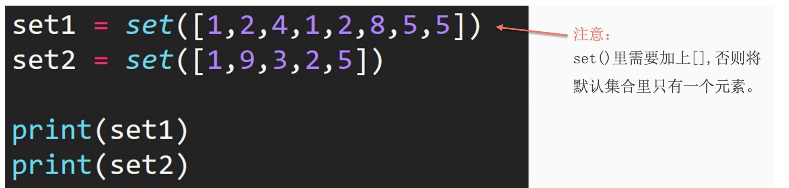

## 1. Creating a Set

1. Directly use curly braces to create.

```python
set1 = {1, 2, 3, 4, 5}
```

2. Use the `set()` method.



## 2. Set Intersection

Intersection: Find elements that appear in both sets, implemented using the `&` operator.

```python
set1 = {1, 2, 3, 4, 5}
set2 = set([1, 2, 5, 6, 8])
print(set1 & set2)

# output
{1, 2, 5}
```

## 3. Set Union

Union: Find elements that are common in both sets, implemented using the `|` operator.

```python
set1 = {1, 2, 3, 4, 5}
set2 = set([1, 2, 5, 6, 8])
print(set1 | set2)

# output
{1, 2, 3, 4, 5, 6, 8}
```

## 4. Set Difference

Difference: When finding the difference between set1 and set2, it returns elements in set1 but not in set2, implemented using the `-` operator.

```python
set1 = {1, 2, 3, 4, 5}
set2 = set([1, 2, 5, 6, 8])
print(set1 - set2)

# output
{3, 4}
```

## 5. Set Symmetric Difference

Symmetric Difference: When finding the symmetric difference between set1 and set2, it returns elements that exist in set1 or set2 but not in both, implemented using the `^` operator –> equivalent to the union minus the intersection, Venn diagram.

```python
set1 = {1, 2, 3, 4, 5}
set2 = set([1, 2, 5, 6, 8])
print(set1 ^ set2)

# output
{3, 4, 6, 8}
```

## 6. Reflection

Can symmetric difference be achieved using the other three set operations? How?

Using union minus intersection.

```python
set1 = {1, 2, 3, 4, 5}
set2 = set([1, 2, 5, 6, 8])
U = set1 | set2
N = set1 & set2
print(U - N)

# output
{8, 3, 4, 6}
```

## 7. .add() - Adding Elements to a Set

```python
set1 = {1, 2, 3, 4, 5}
set2 = set([1, 2, 5, 6, 8])
set1.add(9)
print(set1)

# output
{1, 2, 3, 4, 5, 9}
```
