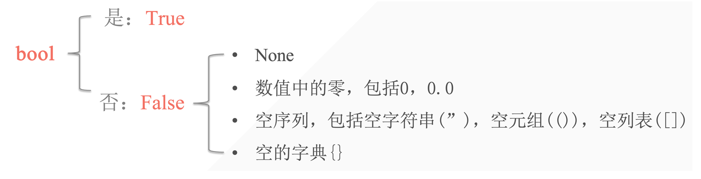
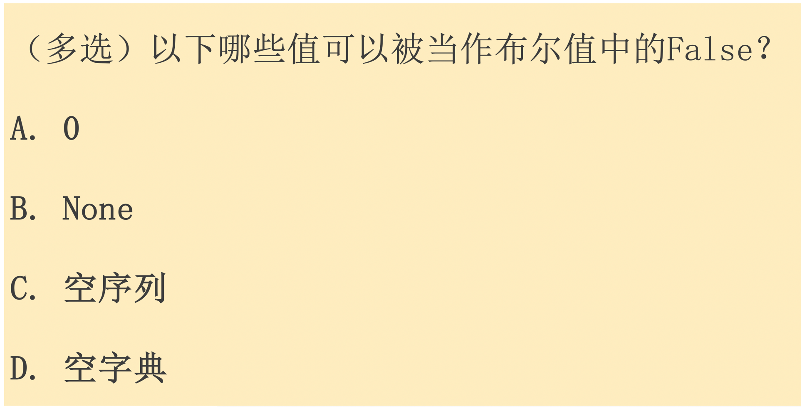

## 1. Boolean Values

Meaning: Represents true or false in judgments, generally used in conditional tests.

```python
a = True
print(a)
print(10 < 5)
print(10 > 8)

# output
True
False
True
```



- All non-empty values are considered `True`.
- All empty sequences, empty numbers are considered `False`.

## 2. Logical Operators

Logical operators: Used to check if two or more conditions are satisfied.

Logical operators exist only in booleans.

| Logical Operator    | Description                                           |
| ------------------- | :---------------------------------------------------- |
| and ("logical and") | Returns True if both operands are True.               |
| or ("logical or")   | Returns True if at least one of the operands is True. |
| not ("logical not") | Used to reverse the state of the operand.             |

| exp         | bool           | value | Return value  ===  print(exp)                                |
| ----------- | -------------- | ----- | ------------------------------------------------------------ |
| 3 and 5     | True and True  | True  | 5       *Evaluates from left to right, returns 5 when it reaches True (both need to be True) |
| 3 or 5      | True or True   | True  | 3       *Only needs one True, so stops at 3                  |
| 0 or 5      | False or True  | True  | 5       *Stops at 5 to satisfy the condition                 |
| 3 and not 5 | True and False | False | False                                                        |
| 0 and 5     | False and True | False | 0        *0 and False are equivalent                         |

```python
s1 = {False, 0}
s2 = {0, False}
print(s1, s2)

# output
{False} {0}  # The set automatically removes duplicates - 0 and False are considered equivalent
```

```python
In [5]: True and False or True 
Out[5]: True
# Evaluates the right side of and first, from right to left

In [6]: False or False or not False
Out[6]: True
```

## 3. Expression Application — Conditional Testing

- Check if the current variable is equal to a specific value.
- Compare the size of numbers.
- Check if a specific value is in a sequence.

### 3.1 Multiple Conditions Checking

Use `and` to check multiple conditions.

```python
age1 = 17
age2 = 18
print(age1 >= 18 and age2 >=18)
print(age1 >= 15 and age2 >=18)

# output
False
True
```

Use `or` to check multiple conditions.

```python
age1 = 17
age2 = 18
print(age1 >= 18 or age2 >=18)
print(age1 >= 15 or age2 >=18)

# output
True
True
```


