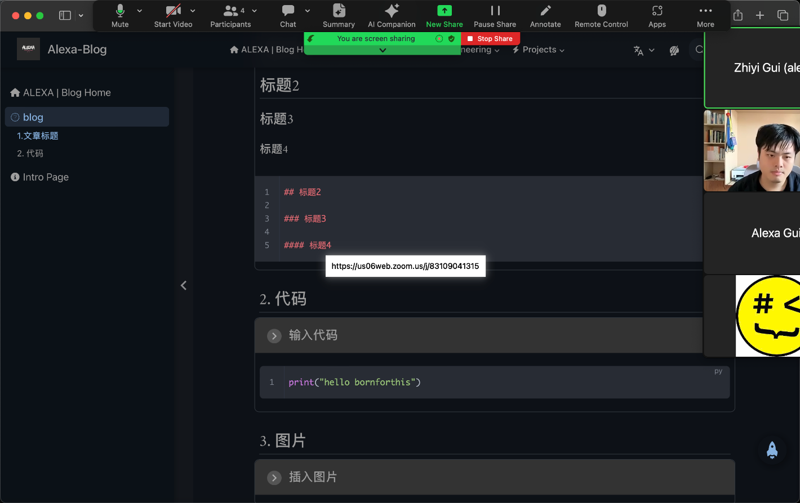

- 文件名不要使用中文
- 用减号代替空格
- 文章内开始第一行要打三个- - -
- 标题 两个井号空格 或者三个井号空格 一共有2-6号标题 除去文章title
- 三个冒号+md-demo 拓展开始 三个冒号结束
- 输入代码 ```python 再开始打 
- 插入图片 复制粘贴 会自动生成文件夹 assests
- 生成链接 [链接名]+(链接)

## 1. 文章标题

::: md-demo 文章标题

## 标题2

### 标题3

#### 标题4

::: 

## 2. 代码

::: md-demo 输入代码

```python
print("hello bornforthis")
```

:::

## 3. 图片

::: md-demo 插入图片



:::

## 4. 有序标题和无序标题, 任务列表

::: md-demo 有序标题和无序标题

- -加空格 生成无序标题

1. 数字+.+空格 生成有序标题

- [ ] 计划A： -空格中括号，括号内加x ： - [x]
- [ ] 计划B

:::

##  5. 信息框/提示容器

:::: md-demo 信息框

里面有其他::: 外侧要用四个冒号

::: important 名称

重要‼️

:::

::: info

信息

:::

::: note

注释

:::

::: tip

提示

:::

::: warning

警告

:::

::: caution

危险

:::

::: details

详情

:::

::::

## 6. 链接

::: md-demo 链接

[链接名](link)

[my website](https://axagiii.com)

:::

## 7. 下划线

::: md-demo 链接

<u>下划线</u>

用<u>+ … + </u>

:::


## 8. 对齐

:::: md-demo 链接

::: left

左对齐内容

:::

::: center

居中

:::

::: right

右对齐内容

:::

::: justify

两端对齐内容

:::

::::

## 9. 公式

::: md-demo

在$$中间\+指令 和latex语法一致

$\sqrt{2}$

$\large\frac{a}{b}$

$\large\sum_{i=0}^{n}\frac{\sqrt{2}}{{2i}}$
$$
\sqrt{2}
\\
\sum_i^{i=0}\frac{1}{2}
$$


:::


## 10. 多媒体

::: md-demo 多媒体

<AudioPlayer src="https://theme-hope-assets.vuejs.press/files/sample.mp3" />

<AudioPlayer src="/music/sample.mp3" />

<BiliBili bvid="xxxxxxx" />

<PDF url="//theme-hope-assets.vuejs.press/files/sample.pdf" />

<VidStack src="https://vp-demo.u2sb.com/video/caminandes_03_llamigos_720p.mp4" />

<YouTube id="0JJPfz5dg20" />

<PDF url="/lecture.pdf" />

<VidStack src="https://vp-demo.u2sb.com/video/caminandes_03_llamigos_720p.mp4" />

:::
