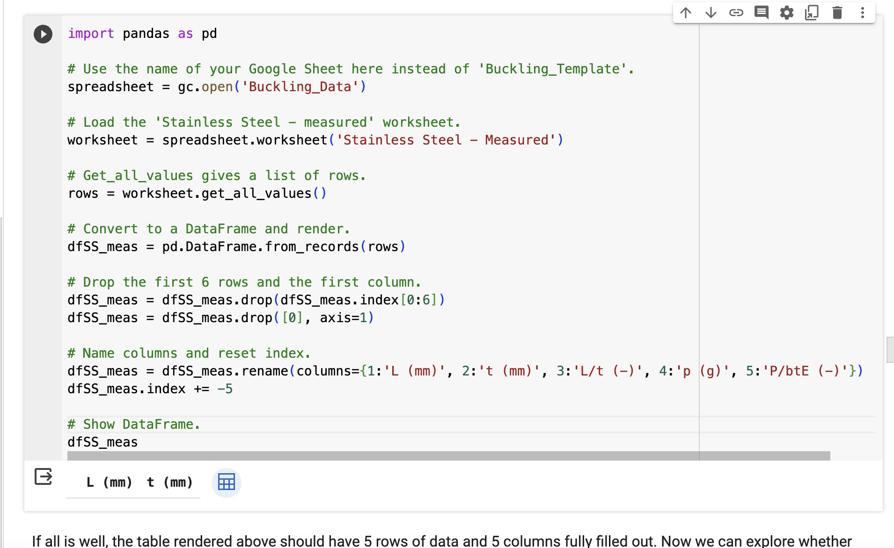

- Do not use Chinese characters for file names.
- Use hyphens instead of spaces.
- Start the first line of the article with three dashes `---`.
- Headings should be formatted with two or three hash symbols followed by a space. Headings range from level 2 to level 6, excluding the article title.
- Begin and end an extended section with three colons `:::` and `md-demo`.
- Use triple backticks with the language identifier to input code:

```python
print("hello bornforthis")
```

- To insert an image, copy-paste it, and it will automatically generate a folder named `assets`.
- Create links using the format `[link name](link)`.

## 1. Article Title

::: md-demo Article Title

## Heading 2

### Heading 3

#### Heading 4

:::

## 2. Code

::: md-demo Input Code

```python
print("hello bornforthis")
```

:::

## 3. Image

::: md-demo Insert Image



:::

## 4. Ordered and Unordered Headings, Task List

::: md-demo Ordered and Unordered Headings

- Use a hyphen and space to create unordered headings.
1. Use number + dot + space to create ordered headings.

- [ ] Plan A: - space inside square brackets, add x: - [x]
- [ ] Plan B

:::

## 5. Information Box/Tip Container

:::: md-demo Information Box

Inside has other :::. Outside should use four colons.

::: important Name

Important‼️

:::

::: info

Information

:::

::: note

Note

:::

::: tip

Tip

:::

::: warning

Warning

:::

::: caution

Caution

:::

::: details

Details

:::

::::

## 6. Links

::: md-demo Links

[Link Name](link)

[my website](https://axagiii.com)

:::

## 7. Underline

::: md-demo Underline

<u>Underline</u>

Use `<u> + ... + </u>`

:::

## 8. Alignment

:::: md-demo Alignment

::: left

Left-aligned content

:::

::: center

Centered

:::

::: right

Right-aligned content

:::

::: justify

Justified content

:::

::::

## 9. Formulas

::: md-demo

Place commands and LaTeX syntax between $$.

$\sqrt{2}$

$\large\frac{a}{b}$

$\large\sum_{i=0}^{n}\frac{\sqrt{2}}{{2i}}$
$$
\sqrt{2}
\\
\sum_i^{i=0}\frac{1}{2}
$$

:::

## 10. Multimedia

::: md-demo Multimedia

<AudioPlayer src="https://theme-hope-assets.vuejs.press/files/sample.mp3" />

<AudioPlayer src="/music/sample.mp3" />

<BiliBili bvid="xxxxxxx" />

<PDF url="//theme-hope-assets.vuejs.press/files/sample.pdf" />

<VidStack src="https://vp-demo.u2sb.com/video/caminandes_03_llamigos_720p.mp4" />

<YouTube id="0JJPfz5dg20" />

<PDF url="/lecture.pdf" />

<VidStack src="https://vp-demo.u2sb.com/video/caminandes_03_llamigos_720p.mp4" />

:::
