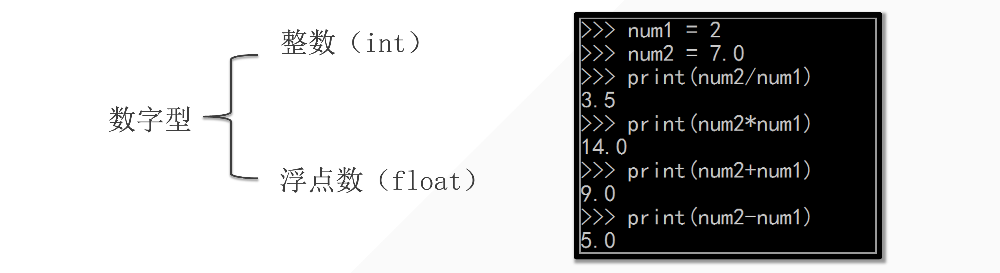

## 1. 数字型的特点



```python
In [2]: 1+1
Out[2]: 2

In [3]: 1+1.0
Out[3]: 2.0

In [4]: 9-1
Out[4]: 8

In [5]: 9-1.0
Out[5]: 8.0

In [6]: 2*2
Out[6]: 4

In [7]: 2*2.0
Out[7]: 4.0

In [8]: 9/3
Out[8]: 3.0

In [9]: # 如果输入中有一个数是float 最后的结果就是float 「优先级最高」

In [10]: # 除法涉及精度问题，所以最后得到浮点数
```

::: tip 规律

- 如果其中有一个浮点数，结果就会得到浮点数「优先级最高」

- 除法涉及精度问题，所以最后的结果类型：就是浮点数

:::


## 2. 算术运算符

**算术运算符：** 用于算术计算。

| 运算符 | 描述                                   | 例子          |
| ------ | -------------------------------------- | ------------- |
| `+`    | 加法运算符                             | `1 + 1 = 2`   |
| `-`    | 减法运算符                             | `2 - 1 = 1`   |
| `*`    | 乘法运算符                             | `2 * 3 = 6`   |
| `/`    | 除法运算符                             | `9 / 3 = 3.0` |
| `**`   | 指数运算符                             | `2 ** 3 = 8`  |
| `%`    | 取余运算符，计算余数                   | `9 % 2 = 1`   |
| `//`   | 除法取整运算符，计算商并去除其小数部分 | `9 // 2 = 4`  |

> tips: 9 / 2 = 4......1

## 3. 小试牛刀：数字变换

假设你有一个两位的整数，我们需要通过以下规则产生两个新的数字：

- 第一个新数字是原数字的两位数中的各个数字的和；
- 第二个新数字是原数字的反转（如原数字为 21，反转后的数字为 12）。

请你编写 Python 代码，实现以上要求。

```python
a = 12
a0 = a // 10
a1 = a % 10
b = a0 + a1
c = 10 * a1 + a0
print(b, c)

# output
3 21
```

**输入：**

一个整数 `num` （10 ≤ num ≤ 99）

**输出：**

两个整数，或者一个错误信息字符串。

**示例：**

假设输入的数字 `num` 为 91，那么你的代码应当输出两个数字：10（9和1的和）和19（91的反转）。

假设输入的数字 `num` 为 26，那么你的代码应当输出两个数字：8（2和6的和）和62（26的反转）。

假设输入的数字 `num` 为 18，那么你的代码应当输出两个数字：9（1和8的和）和81（18的反转）。


## 4. 比较运算符：比较值的大小

| 运算符 | 描述                                           | 例子            |
| ------ | ---------------------------------------------- | --------------- |
| `>`    | 判断第一个运算对象是否大于第二个运算对象       | `print(1 > 2)`  |
| `<`    | 判断第一个运算对象是否小于第二个运算对象       | `print(1 < 2)`  |
| `>=`   | 判断第一个运算对象是否大于或等于第二个运算对象 | `print(3 >= 3)` |
| `<=`   | 判断第一个运算对象是否小于或等于第二个运算对象 | `print(3 <= 4)` |
| `==`   | 判断两个运算对象是否相同                       | `print(2 == 2)` |
| `!=`   | 判断两个运算对象是否不相同                     | `print(2 != 1)` |

> 试一试上面的例子，看看会输出上面结果？

```python
print(1 > 2)
print(1 < 2)
print(3 >= 3)
print(3 <= 4)
print(2 == 2)
print(2 != 1)

# output
False
True
True
True
True
True
```


## 5. 赋值运算符

| 运算符 | 描述                                 | 例子       |
| ------ | ------------------------------------ | ---------- |
| `=`    | 把右侧的运算对象赋值给左侧的运算对象 | `a = 1`    |
| `+=`   | `a += b` 等同于 `a = a + b`          | `a += 10`  |
| `-=`   | `a -= b` 等同于 `a = a - b`          | `a -= 10`  |
| `*=`   | `a *= b` 等同于 `a = a * b`          | `a *= 10`  |
| `/=`   | `a /= b` 等同于 `a = a / b`          | `a /= 10`  |
| `**=`  | `a **= b` 等同于 `a = a ** b`        | `a **= 10` |
| `//=`  | `a //= b` 等同于 `a = a // b`        | `a //= 10` |

```python
a = 1
a += 10
a -= 10
a *= 10
a /= 10
a **= 10
a //= 10
print(a)

# output 
0.0 #除法最后是小数
```

::: code-tabs

@tab 代码示例

```python
# 赋值运算符形式
a = 1
a += 10
print(a) # 输出11

# 常规形式
a = 1
a = a + 10
print(a) # 输出11
```

@tab 例子

```python
a = 1
a += 10
a -= 10
a *= 10
a /= 10
a **= 10
a //= 10
print(a)

# output 
0.0 #除法最后是小数
```

:::

```python
a = 4 // 2 #结果整数
b = 4.5 // 2 #结果小数
print(a, b)

# output
2, 2.0
```


## 7. 练习

### 7.1 选择题

1. 在 Python 中，执行 `3.5 + 4` 的结果是什么类型？

    A. 整数

    B. 浮点数 ✅

    C. 字符串

    D. 布尔值

2. 以下哪个运算符用于取余？

    A. `+`

    B. `-`

    C. `*`

    D. `%` ✅

3. 在 Python 中，执行 `9 // 2` 的结果是多少？

    A. 4.5

    B. 4 ✅

    C. 5

    D. 4.0 

4. `1.0 == 1` 在 Python 中的结果是什么？

    A. True 🙆✅

    B. False ✅ ❌

    C. 报错

    D. 无法确定

5. `2 + 3 * 4` 的结果是多少？

    A. 20

    B. 14 ✅

    C. 24

    D. 12

6. 在 Python 中，`10 / 3` 的结果是什么？

    A. 3

    B. 3.3333 🙆✅ 

    C. 4

    D. 3.3 ✅❌

7. 执行 `7 // 2` 的结果是多少？

    A. 3 ✅

    B. 3.5

    C. 4

    D. 2

8. 在 Python 中，以下哪个操作会返回浮点数？

    A. `2 * 3`

    B. `4 + 2`

    C. `9 / 2` ✅

    D. `5 // 2`

9. `4 ** 0.5` 的结果是多少？

    A. 2

    B. 4

    C. 16

    D. 0.5

    E. 2.0 ✅

10. 执行 `3 >= 3` 的结果是什么？

    A. True ✅

    B. False

    C. 报错

    D. 无法确定

11. 执行 `4 != 4` 的结果是什么？

    A. True

    B. False ✅

    C. 报错

    D. 无法确定

12. 在 Python 中，`5 + 2 * 3` 的结果是什么？

    A. 21

    B. 11 ✅

    C. 14

    D. 7

13. 执行 `6 / 2` 的结果是什么类型？

    A. 整数

    B. 浮点数 ✅

    C. 字符串

    D. 布尔值


### 7.2 填空

1. 在 Python 中，执行 `2 ** 3` 的结果是 `___8___`。
2. 执行表达式 `9 % 4` 会得到 `___1___` 作为结果。
3. 如果 `a = 5`，那么执行 `a *= 2` 之后，`a` 的值是 `___10___`。
4. 在 Python 中，`3 == 2.9999` 的结果是 `___False___`。
5. 执行 `5 <= 5` 的结果是 `___True___`。
6. 如果 `b = 3`，执行 `b /= 2` 后，`b` 的值是 `___1.5___`。
7. 执行 `4 % 3` 的结果是 `___1___`。
8. 如果 `c = 10`，执行 `c //= 3` 后，`c` 的值是 `___3___`。
9. 在 Python 中，`7 == 7.0` 的结果是 `___False___`。❌True
10. 执行 `8 / 2` 的结果是 `___4.0___`。

### 7.3 编程题

::: tip 提示

测试部分代码，没有任何输出没有报错，则视为作答正确。

但是要编写符合题目要求的输出。

:::

#### 7.3.1 数字和与差：

编写一段 Python 代码，创建两个数字 `a` 和 `b`，计算并打印出它们的和以及 `a` 减去 `b` 的结果。

**代码模版**

```python
a = 10
b = 5
Sum = a + b
Difference = a - b
print(Sum, Difference)
# 测试
assert sum_result == a + b
assert difference == a - b
```

**输出示例：**

```python
Sum: 8
Difference: 2
```


#### 7.3.2 数字的乘法和除法

编写一段 Python 代码，创建两个数字 `x` 和 `y`，计算并打印出它们的乘积和除法结果。

**代码模版**

```python
x = 10
y = 5
product = x * y
division = x / y
print(product, division)

# 测试
assert product == x * y
assert division == x / y
```

**输出示例：**

```python
Product: 12
Division: 3.0
```


#### 7.3.3 求余和幂运算

编写一段 Python 代码，创建两个数字 `m` 和 `n`，计算并打印出 `m` 对 `n` 取余的结果和 `m` 的 `n` 次幂。

**代码模版**

```python
m = 10
n = 5
floor_div = m // n
power = m ** n
print(floor_div, power)

# 测试
assert remainder == m % n
assert power == m ** n
```

**输出示例：**

```python
Remainder: 1
Power: 81
```


#### 7.3.4 比较运算

编写一段 Python 代码，输入两个数字 `p` 和 `q`，比较它们的大小并打印出相应的比较结果（大于、小于、等于）。

**代码模版**

```python
p = 10
q = 5
if p > q:
    print(p, " is greater than ", q)
elif p < q:
    print(p, " is less than ", q)
else:
    print(p, " is equal to ", q)
    

if ______:
    print(f"{p} is greater than {q}")
    assert p > q
elif ______:
    print(f"{p} is less than {q}")
    assert p < q
else:
    print(f"{p} is equal to {q}")
    assert p == q

```

**输出示例：**

```python
4 is less than 5
```
