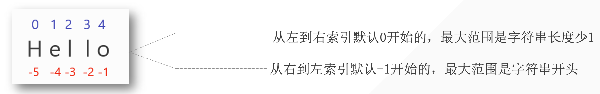

---

title: 字符串
date: 2023-12-18 13:40:10
author: Alexa
isOriginal: true
category: 
    - Python
tag:
    - web
    - typora
icon: coding
sticky: false
star: false
article: true
timeline: true
image: false
navbar: true
sidebarIcon: true
headerDepth: 5
comment: true
lastUpdated: true
---

## 1. 字符串的定义

字符串是由字母，数字，特殊字符来组成的一个序列



## 2. 创建字符串

——使用 **<span style="color:orange">单引号、双引号</span>或者<span style="color:orange">三引号</span>**。

```python
name = "alexa"
number = '18'
paragraph = '''Hello, I'm Alexa
'''
para = """Hello Alexa
"""
```

1. 单双引号混用 所以会需要接受不同类型的引号, 否则不能完全包裹字符串内容

```python
string = 'I'm Alexa # wrong
string = "I'm Alexa" # correct
```

那么三引号呢？

假设我们现在需要存储如下文本：

```python
我们有时候不仅仅要看选择项以内的答案，也要去思考选择项以外的答案。——AI悦创

浅者见浅，深者见深——黄家宝

起的最早的是理想主义者，跑的最快的是骗子，而胆子最大的是那些冒险家，害怕错过一切，疯狂往里冲的是韭菜，而真正的成功者，可能还没有入场。

先实现功能，再去优化，否则一切会很乱。——AI悦创

凡是你不能清晰写下来的东西，都是你还没有真正理解的东西
```

放入字符串，我们如何在 Python 代码实现呢？

::: code-tabs

@tab 双引号

```python
string = "我们有时候不仅仅要看选择项以内的答案，也要去思考选择项以外的答案。——AI悦创

浅者见浅，深者见深——黄家宝

起的最早的是理想主义者，跑的最快的是骗子，而胆子最大的是那些冒险家，害怕错过一切，疯狂往里冲的是韭菜，而真正的成功者，可能还没有入场。

先实现功能，再去优化，否则一切会很乱。——AI悦创

凡是你不能清晰写下来的东西，都是你还没有真正理解的东西"

# 这样会只能包裹到第一行内容
```

@tab 双引号+斜杠

```python
string = "我们有时候不仅仅要看选择项以内的答案，也要去思考选择项以外的答案。——AI悦创\

浅者见浅，深者见深——黄家宝\

起的最早的是理想主义者，跑的最快的是骗子，而胆子最大的是那些冒险家，害怕错过一切，疯狂往里冲的是韭菜，而真正的成功者，可能还没有入场。\

先实现功能，再去优化，否则一切会很乱。——AI悦创\

凡是你不能清晰写下来的东西，都是你还没有真正理解的东西"

# output
我们有时候不仅仅要看选择项以内的答案，也要去思考选择项以外的答案。——AI悦创浅者见浅，深者见深——黄家宝起的最早的是理想主义者，跑的最快的是骗子，而胆子最大的是那些冒险家，害怕错过一切，疯狂往里冲的是韭菜，而真正的成功者，可能还没有入场。先实现功能，再去优化，否则一切会很乱。——AI悦创凡是你不能清晰写下来的东西，都是你还没有真正理解的东西

#加斜杠可以包裹 但是不能换行
#所以需要使用三引号
```

@tab 三引号

```python
string = """我们有时候不仅仅要看选择项以内的答案，也要去思考选择项以外的答案。——AI悦创

浅者见浅，深者见深——黄家宝

起的最早的是理想主义者，跑的最快的是骗子，而胆子最大的是那些冒险家，害怕错过一切，疯狂往里冲的是韭菜，而真正的成功者，可能还没有入场。

先实现功能，再去优化，否则一切会很乱。——AI悦创

凡是你不能清晰写下来的东西，都是你还没有真正理解的东西"""

# 实现原样输出
```

:::

三引号还可以用来注释


## 3. 字符串长度

使用`len()`: 返回字符串中字符长度或字符数，从一开始数, 包括空格

```python
para = "Hello, alexa"
print(len(para))

# output
12
```


## 4. 字符串中的字符获取

### 4.1 获取单个字符

```python
para = "Hello, alexa"
print(para[2])   # selecting the 3rd character
print(para[0])  # selecting the 1st character
print(para[-1])  # selecting the last character
print(para[len(para)-1])  # selecting the last character
```

### 4.2 获取一串连续字符

使用slicing区间 （左闭右开）string[start: end]

```python
"""语法: string = "bornforthis"
select = string[start: end]
PS: end 记得 +1"""

para = "Hello, alexa"
print(para[2:6])  # selecting the 3rd to the 6th character (not including the 7th)
# output
llo,
```

### 4.3 获取多个不连续字符

使用slicing区间 string[start: end: sep]

```python
"""
语法: string = "0123456789"
select = string[start: end: sep] *sep= how many steps to the next number*
PS: end 记得 +1
"""
string = "0123456789"
# 获取字符 02468
select = string[0: len(string): 2]
print(select)
# 获取字符 13579
select = string[1: len(string): 2]
print(select)

string = "bornforthis"
# 获取字符 ofts
select = string[1: len(string): 3]
print(select)
```

### 4.4 优化

如果我们要提取的字符是从开头到结尾，则可以省略开头和/或结尾，留空即可

```python
string = "0123456789"
# 获取字符 02468
select = string[:: 2]
print(select)
# 获取字符 13579
select = string[1:: 2]
print(select)
```

### 4.5 字符串倒序

字符串的第三个位置，控制的是字符提取的方向。默认正数为1，如果我们改成-1，则会变成反方向

::: warning

正负控制方向，数字大小控制步长

:::

```python
string = "bornforthis"
select = string[:: -1]
print(select)

# output
sihtrofnrob
```

省略号省略的是什么？

```python
select = string[0:11: -1]
print(select)

# output
No result
```

如果使用正方向序号， 0开始往-1走没有任何值， 不成立


如果直接使用正数序号调换位置，最后一位就是0，会被省略掉：

```python
select = string[len(string):0: -1]
print(select)

# output
sihtrofnro #missing "b"
```


所以应该是从-1最后一位开始往回倒:


```python
select = string[-1:-1*len(string)-1: -1]
print(select)
```

```python
# 获取rofn
select = string[-5:-9: -1]
print(select)
```


## 5. 字符串的内置方法

### 5.1 .upper()

将字符串全部转换为大写

```python
string = "bornforthis"
print(string.upper())

# output
BORNFORTHIS
```

### 5.2 .lower()

将字符串全部转换为小写

```python
string = "BORNFORTHIS"
print(string.lower())

# output
bornforthis
```

### 5.3 .capitalize()

字符串开头第一个字母大写

```python
string = "BORNFORTHIS"
print(string.capitalize())

# output
Bornforthis
```

### 5.4 .title()

每个单词的首字母大写，只要有间隔都会大写 「形成标题的一种格式」

```python
string = "BORNFORTHIS to-aiyc"
print(string.title())

# output
Bornforthis To-Aiyc
```

### 5.5 .startswith()

检测字符串是否以某个特定的内容开头，返回True或False

```python
string = "BORNFORTHIS to-aiyc"
print(string.startswith("b"))

# output
False

string = "BORNFORTHIS to-aiyc"
print(string.startswith("BO"))

# output
True
```

### 5.6 .endswith()

检测字符串是不是以特定字符或单词结尾，返回布尔值。

```python
string = "BORNFORTHIS to-aiyc"
print(string.endswith("BO"))
# output
False

string = "BORNFORTHIS to-aiyc"
print(string.endswith("yc"))
# output
True
```

### 5.7 .count()

计算特定字符或单词在目标字符串中存在的次数。

```python
string = "BORNFORTHIS to-aiyc bornforthis"
print(string.count("i"))
# output
2 #区分大小写

string = "BORNFORTHIS for-aiyc bornforthis"
print(string.count("for"))
# output
2
```

### 5.8 .find()

寻找目标字符或单词在特定字符串中，第一次出现的下标。如果是查找单词，那么 `find()` 返回目标单词的第一个字符的下标。

如果，查询的字符或单词不存在，则返回 `-1`。

```python
string = "BORNFORTHIS for-aiyc bornforthis"
print(string.find("for"))

# output
12 #返回第一次出现时的下标

string = "BORNFORTHIS for-aiyc bornforthis"
print(string.find("R"))

# output
2

string = "BORNFORTHIS for-aiyc bornforthis"
print(string.find("k"))

# output
-1
```

### 5.9 .index()

寻找目标字符或单词在特定字符串中，第一次出现的下标。如果是查找单词，那么 `index()` 返回目标单词的第一个字符的下标。

如果，查询的字符或单词不存在，则**报错**。

```python
string = "BORNFORTHIS for-aiyc bornforthis"
print(string.index("k"))

# output
ValueError: substring not found
```

### 5.10 .isdigit()

判断字符串是不是纯数字字符串，字符串中但凡有一个字符不是数字，则返回false

```python
string = "01234567"
print(string.isdigit())

# output
True

string = "01234567o"
print(string.isdigit())

# output
False
```

### 5.11 .isalpha()

判断字符串是不是纯字母字符串，字符串中但凡有一个字符不是字母，则返回false

```python
string = "abcdefg"
print(string.isalpha())

# output
True

string = "abcdefg0"
print(string.isalpha())

# output
False
```

### 5.12 .isalnum()

判断字符串是不是纯数字或纯字母、纯数字字母字符串，字符串中但凡出现非数字、字母元素，则返回 False。

```python
string = "abcdefg0"
print(string.isalnum())

# output
True

string = "abcdefg0!"
print(string.isalnum())

# output
False
```

### 5.13 .isupper()

判断字符串中的字母是否全大写，全大写则返回 True，否则返回 False。

```python
string = "abcdefg0!"
print(string.isupper())

# output
False
```

### 5.14 .islower()

判断字符串是不是字母全小写，全小写则返回 True，否则返回 False。

```python
string = "abcdefg0!"
print(string.islower())

# output
True
```

### 5.15 .isspace()

判断字符串是否为纯空格，多少个空格都可以。纯空格则返回 True，否则返回 False。

```python
string = "abcdefg0!"
print(string.isspace())

# output
False

string = "   "
print(string.isspace())

# output
True
```

### 5.16 .strip()

默认去掉目标字符串的前后空白字符，如果指定参数，可以去掉指定字符

```python
string = "   bornforthis   "
print(string.strip()) #去除前后空格
# output
bornforthis

string = "---bornforthis---"
print(string.strip("-")) #去除前后减号
# output
bornforthis

string = "--  -bornforthis-- -"
print(string.strip("-")) #如果只去除前后减号 只会去除连续的减号知道遇见其他字符
# output
  -bornforthis-- 
    
string = "--  -bornforthis-- -"
print(string.strip("- ")) #同时去除两端的所有减号和空格
# output
bornforthis
```

### 5.17 .lstrip()

left 默认去掉字符串左边的空白字符，如果指定参数，则去掉左边的指定字符。

```python
string = "--  -bornforthis-- -"
print(string.lstrip("- "))
# output
bornforthis-- -
```

### 5.18 .rstrip()

Right 默认去掉字符串右边的空白字符，如果指定参数，则去掉右边的指定字符。

```python
string = "--  -bornforthis-- -"
print(string.rstrip("- "))
# output
--  -bornforthis
```

### 5.19 .replace()

`.replace(old, new, count)`第一个位置传入待替换的「old」字符，第二个位置传入要替换的新字符「new」，count控制替换次数

```python
string = "--  -bornforthis-- -"
string1 = string.replace(" ","*") #默认把所有空格都换成*
string2 = string.replace("-", "!", 3) #置换前三个减号为！
print(string, string1, string2, sep="\n")

# output
--  -bornforthis-- -
--**-bornforthis--*-
!!  !bornforthis-- -
```

### 5.20 .split()

`.split(sep, maxsplit)` 以特定字符进行分割，默认空格分割。如传入参数「sep」则以参数进行分割，返回分割后的列表，maxsplit用于控制分割几次, 默认从左边开始分割

```python
string = "i am bornforthis bornforthis"
lst1 = string.split()
lst2 = string.split("o")
lst3 = string.split("o", 3)
print(string, lst1, lst2, lst3, sep="\n")

# output
i am bornforthis bornforthis
['i', 'am', 'bornforthis', 'bornforthis']
['i am b', 'rnf', 'rthis b', 'rnf', 'rthis']
['i am b', 'rnf', 'rthis b', 'rnforthis']
```

### 5.21 .rsplit()

`.rsplit(sep, maxsplit)` 从字符串右边进行分割，也可以传入参数「sep」，进行指定分割。返回分割后的列表。maxsplit 指定分割次数。

```python
string = "i am bornforthis bornforthis"
lst1 = string.rsplit()
lst2 = string.rsplit("o")
lst3 = string.rsplit("o", 3)
print(string, lst1, lst2, lst3, sep="\n")

# output
i am bornforthis bornforthis
['i', 'am', 'bornforthis', 'bornforthis']
['i am b', 'rnf', 'rthis b', 'rnf', 'rthis']
['i am bornf', 'rthis b', 'rnf', 'rthis']
```

### 5.22 .join()

以特定字符为字符串每个字符中间的间隔 `“sep”.join(string)`

```python
string = "i am bornforthis "
string_joined = "-".join(string)
print(string_joined)

# output
i- -a-m- -b-o-r-n-f-o-r-t-h-i-s- 
```


## 6. 字符串格式化

问题

```python
string = "Hi Bornforthis,Welcome to XiaMen."
print(string)

# ---output---
Hi Bornforthis,Welcome to XiaMen.
```

- 所存在的问题：需要换一个人名或者地区，就需要重新创建一个全新的字符串。
- 我们更希望有类似模版，让我们不同的人名、地面填写进去。而不是每个人都从头创建一个新字符串。

当然，这个时候有可能会想到使用字符串的加法，但字符串加法存在问题。

```python
name = "Bornforthis"
region = "XiaMen"
string1 = "Hi "
string2 = ",Welcome to "
string3 = "."
result = string1 + name + string2 + region + string3
print(result)

# ---output---
Hi Bornforthis,Welcome to XiaMen.
```

由上面的代码可知，虽然实现了。但是很繁琐，如果更复杂的字符串就不合适了。

而且另一个问题就是，在 Python 中不同的数据类型不能直接相加，除非强制转换类型为字符串：

```python
string = "Money is " + 190
print(string)


# ---output---
Traceback (most recent call last):
  File "/Users/huangjiabao/GitHub/iMac/Pycharm/StudentCoder/40-YEWENTE/demo1.py", line 1, in <module>
    string = "Money is " + 190
TypeError: can only concatenate str (not "int") to str


string = "Money is " + str(190)
print(string)
# ---output---
Money is 190
```

—— **format** 就应运而生了。

### 6.1 .format()

1. 单个花括号{}: 三种方法

```python
string = "Hi {}, welcome to XiaMen.".format("Alexa")
print(string)

template_string = "Hi {}, welcome to XiaMen."
print(template_string.format("Alexa"))

new_string = template_string.format("Alexa")
print(new_string)

# output
Hi Alexa, welcome to XiaMen.
Hi Alexa, welcome to XiaMen.
Hi Alexa, welcome to XiaMen.
```

2. 一个花括号以上「按顺序填充」

```python
string = "Hi {}, welcome to {}.".format("Alexa", "XiaMen")
print(string)

template_string = "Hi {}, welcome to {}."
print(template_string.format("Alexa", "XiaMen"))

new_string = template_string.format("Alexa", "XiaMen")
print(new_string)

# output
Hi Alexa, welcome to XiaMen.
Hi Alexa, welcome to XiaMen.
Hi Alexa, welcome to XiaMen.
```

3. 多个花括号指定位置「序号指定」

```python
string = "Hi {1}, welcome to {0}.".format("0", "1")
print(string)

string = "Hi {1}, welcome to {0}.".format("XiaMen", "Alexa")
# 0th position input:XiaMen, 1st position input:Alexa
print(string)

template_string = "Hi {1}, welcome to {0}."
print(template_string.format("Shanghai", "Alexa"))

new_string = template_string.format("Shenzhen", "Alexa")
print(new_string)

# output
Hi 1, welcome to 0.
Hi Alexa, welcome to XiaMen.
Hi Alexa, welcome to Shanghai.
Hi Alexa, welcome to Shenzhen.
```

4. 参数指定

```python
string = "Hi {name}, welcome to {city}.".format(name="name", city="city")
print(string)

string = "Hi {name}, welcome to {city}.".format(name="Alexa", city="XiaMen")
print(string)

template_string = "Hi {name}, welcome to {city}."
print(template_string.format(name="Alexa", city="Shanghai"))

new_string = template_string.format(name="Alexa", city="Shenzhen")
print(new_string)

# output
Hi name, welcome to city.
Hi Alexa, welcome to XiaMen.
Hi Alexa, welcome to Shanghai.
Hi Alexa, welcome to Shenzhen.
```

5. 保留指定小数位置： `{:.xf}`保留x位小数

```python
string = "Money is {:.3f}".format(190)  # .3f 保留三位小数
print(string)

# output
Money is 190.000
```

### 6.2 f

1. 直接读取变量 （变量必须提前创建好）

```python
name = "Alexa"
city = "XiaMen"
string = f"Hi {name}, welcome to {city}."
print(string)
# 使用f前变量必须都被创建好

# output
Hi Alexa, welcome to XiaMen.
```

2. 保留小数位 `{variable: .xf}`将variable保留到x位小数

```python
money = 190
string = f"Money is {money:.3f}."
print(string)

# output
Money is 190.000.
```

### 6.3 %格式化

- `%d`: 整数
- `%s`: 字符串
- `%f`: 浮点数

1. 单个位置传入 (三种方法：用%+数字来输入； d/s/f控制输入类型)

```python
string = "Money is %d"
new_s = string % 13
print(new_s)

print(string % 19)

string = "Money is %d" % 190
print(string)

# output
Money is 13 
Money is 18 
Money is 190 
```

2. 多个位置传入： %后要用括号

```python
string = "Money is %d %s"
new_s = string % (13, "发大财")
print(new_s)

print(string % (18, "暴富"))

string = "Money is %d %s" % (190, "666")
print(string)

# output
Money is 13 发大财
Money is 18 暴富
Money is 190 666
```

3. 保留小数位: %.xf

```python
string = "Money is %.3f"
new_s = string % 13
print(new_s)

print(string % 18)

string = "Money is %.3f" % 190
print(string)

# output
Money is 13.000
Money is 18.000
Money is 190.000
```

### 6.4 f 和 format、% 的优缺点
format 和 % 都像模版，提前做好模版后面有需要试可以直接使用；

而 f 就像在银行当中，柜员边问你边登记，不能提前做好模版。

## 7. 字符串的不可变性

字符串是不可变的，不可以改变其中的任何元素。如果改变字符串中的元素，则需要创建一个新的字符串

```python
s = "hello bornforthis"
s[0] = "a"

# ---output---
Traceback (most recent call last):
  File "/Users/huangjiabao/GitHub/iMac/Pycharm/StudentCoder/39-YDN/lesson3.py", line 2, in <module>
    s[0] = "a"
TypeError: 'str' object does not support item assignment
```

除了使用replace 还可以使用字符串拼接

```python
string = "Hello, Alexa!"
new_string = "a" + string[1:] #使用slicing
print(new_string)

# output
aello, Alexa!
```

## 8. 字符串转义

| 转义字符 | 含义                               | 例子                     |
| -------- | ---------------------------------- | ------------------------ |
| `\\`     | 反斜杠符号，为了在字符串中得到 `\` | `s = "bor\\nforthis"`    |
| `\b`     | 退格，类似删除键                   | `s = "bornff\borthis"`   |
| `\n`     | 换行                               | `s = "bornfor\nthis"`    |
| `\t`     | 制表符                             | `s = "born\tfor\tthis"`  |
| `r`      | 取消转义「R 和 r」都可以           | `s = r"born\tfor\tthis"` |

示例代码：

```python
s = "bor\\nforthis"
# 原本使用\n的话会导致字符串换行， 但是如果想要输出\n，需要在\前再加一个\
print(s)

# output
bor\nforthis

s = "bornff\borthis"
# \b删除前一个字符 f
print(s)

# output
bornforthis

s = "bornfor\nthis"
# \n换行
print(s)

# output
bornfor
this

s = "born\tfor\tthis"
# \t制表
print(s)

# output
born	for	this

s = r"born\tfor\tthis"
# 还可以用r取消转义
print(s)

# output
born\tfor\tthis
```

## 9 字符串的连接

```python
s1 = 'born'
s2 = 'forthis'
print(s1 + s2)  # 形成了一个字符串
print(s1, s2)  # 还是两个独立的字符串

# ---output---
bornforthis
born forthis


s1 = '*-love-'
print(s1 * 10)

# ---output---
*-love-*-love-*-love-*-love-*-love-*-love-*-love-*-love-*-love-*-love-
```

我想在上面的输出添加末尾加一个 * 怎么办呢？

```python
print(s1*10 + "*")
print(s1*10 + s1[0])
print(s1*10, end="*")
```

## 10. 读取用户输入

### 10.1 input()基本使用

使用 `input()` 获取用户输入

```python
user_input = input()
print(user_input)

# output
alexa # self input
alexa # print
```

### 10.2 input()输入提示

但是上面的代码，有点小问题：在运行的时候并不能很直观的知道，程序需要我们输入，何况非程序员用户呢？


如何解决？——使用输入提示。

`input()` 函数里面支持我们写入字符串进行提示。

```python
user_input = input("Enter your name:>>>")
print("user input name:", user_input)

# output
Enter your name:>>> alexa
user input name:  alexa
```


### 10.3 input() 的特点

#### 10.3.1 input()得到类型皆为字符串「str」

```python
In [2]: type(input("i:>>>"))
i:>>>1
Out[2]: str

In [3]: type(input("i:>>>"))
i:>>>[1,2,3,4]
Out[3]: str

In [4]: type(input("i:>>>"))
i:>>>(1,2,3,4)
Out[4]: str
```

通过上面的代码示例，我们可以知道：通过 `input()` 获取用户输入，得到的数据类型都是**字符串**。

得知 `input()` 的特点后，如何解决这个问题呢？——用户如何实现：直接输入原有的类型并得到原有的类型。

#### 10.3.2 方法一：强制类型转换

```python
In [10]: n = int(input(':>>>'))
:>>>12

In [11]: type(n)
Out[11]: int

In [12]: # 存在一些问题

In [13]: s = list(input(':>>>'))
:>>>[1, 2, 3, 4, 5]

In [14]: s  # 得到把每一个元素拆开
Out[14]: ['[', '1', ',', ' ', '2', ',', ' ', '3', ',', ' ', '4', ',', ' ', '5', ']']

In [15]: type(s)
Out[15]: list

In [16]: b = bool(input(':>>>'))
:>>>True

In [17]: b
Out[17]: True

In [18]: type(b)
Out[18]: bool
```

- 适合：数字，字符串，布尔型
- 不适合：列表，元组，字典，集合

#### 10.3.3 方法二：使用eval（）

1. eval()的妙用

```python
In [28]: s = eval(input(':>>>'))
:>>>12

In [29]: type(s), s
Out[29]: (int, 12)

In [30]: s = eval(input(':>>>'))
:>>>[1, 2, 3]

In [31]: type(s), s
Out[31]: (list, [1, 2, 3])

In [32]: s = eval(input(':>>>'))
:>>>(1, 2, 3)

In [33]: type(s), s
Out[33]: (tuple, (1, 2, 3))

In [34]: s = eval(input(':>>>'))
:>>>{1, 2, 3}

In [35]: type(s), s
Out[35]: (set, {1, 2, 3})

In [36]: s = eval(input(':>>>'))
:>>>True

In [37]: type(s), s
Out[37]: (bool, True)

In [38]: s = eval(input(':>>>'))
:>>>{'a': 1, 'b': 2}

In [39]: type(s), s
Out[39]: (dict, {'a': 1, 'b': 2})
```

2. eval()伴随的问题

上面的代码看似解决了我们所遇到的问题，但是也伴随着我们需要注意的问题。

```python
In [14]: s = eval(input(":>>>"))
:>>>string
---------------------------------------------------------------------------
NameError                                 Traceback (most recent call last)
Cell In[14], line 1
----> 1 s = eval(input(":>>>"))

File <string>:1

NameError: name 'string' is not defined
```

稍微分析一下 `eval()` 的功能“大概”实现原因：

- input 获取用户输入，得到字符串类型。

```python
In [44]: s = input(':>>>')
:>>>[1, 2, 3]

In [45]: s
Out[45]: '[1, 2, 3]'

In [15]: s = input(":>>>")
:>>>string

In [16]: s
Out[16]: 'string' #在使用input时会给原本输入的内容加上引号变成str
```

从上面的代码可以得知，eval 大概率实现的是去掉字符串左右两边的引号。「这个地方 eval 或许不是按我说的实现，但是为了让你们更好理解原理，先这样来。」

所以，为什么会导致上面的报错呢？

1. 获取用户输入：`s = eval(input(':>>>'))`
2. 其中 input 会得到 `'string'`，而通过 `eval` 转换之后，就类似于 `string` 变量。但是我们实际上我们在我们之前的代码中，并没有创建 string 这个变量。
3. 故而报错，当然没有通过上面的分析也可以大概预料到问题，因为报错很直观：`NameError: name 'string' is not defined` 。
4. 所以，解决方法很直白：
    1. 一种是你在获取用户输入之前直接提前创建一个叫做 string 的变量；「显然，不是我们想要的」
    2. 另一种则是输入的时，有意加上单引号或者双引号、三引号。

```python
In [17]: string = "hello"

In [18]: s = eval(input(":>>>"))
:>>>string

In [19]: s
Out[19]: 'hello'

In [20]: num = 12

In [21]: s = eval(input(":>>>"))
:>>>num

In [22]: s
Out[22]: 12

In [23]: type(s), s
Out[23]: (int, 12)

In [24]: s = eval(input(":>>>"))
:>>>"string"

In [25]: type(s), s
Out[25]: (str, 'string')
```

3. `eval()`小技巧

任务要求：获取户输入，实现两位的加减乘除。

```python
In [26]: eval(input(":>>>"))
:>>>1+1
Out[26]: 2

In [27]: eval(input(":>>>"))
:>>>2-1
Out[27]: 1

In [28]: eval(input(":>>>"))
:>>>9*8
Out[28]: 72

In [29]: eval(input(":>>>"))
:>>>9/3
Out[29]: 3.0
```

## 11. 小试牛刀

获取用户输入来看两个整数，得到两个整数的和。

**要求：**

- 只能使用一个 input 函数；
- 用户输入格式：num1 num2
- 输出计算结果；

**输入：**

```python
5 6
```

**输出：**

```python
11
```

:::code-tabs

@tab Code1

```python
nums = eval(input(":>>>").replace(" ", "+")) # use eval and replace
print(nums)
```

@tab Code2

```python
nums = input(":>>>").split() # split直接在space处分割并返回列表
sum = int(nums[0]) + int(nums[1]) # 转换成数字
print(sum)
```

