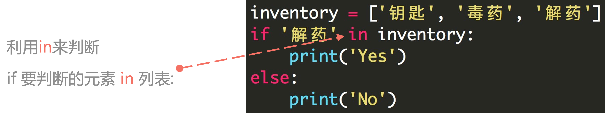

---

title: list
date: 2023-12-30 13:40:10
author: Alexa
isOriginal: true
category: 
    - Python
tag:
    - web
    - typora
icon: coding
sticky: false
star: false
article: true
timeline: true
image: false
navbar: true
sidebarIcon: true
headerDepth: 5
comment: true
lastUpdated: true
---

## 1. 列表结构

- 利用 **<span style="color:orange">中括号</span>** 表示列表
- 列表内的元素用 **<span style="color:orange">逗号</span>** 隔开
- 注意是 **<span style="color:orange">英文输入法</span>** 下的逗号

```python
student1 = ['lilei', 18, 'class01', 201901]
student2 = ['hanmeimei', 19, 'class02', 201902]
```

列表的 **<span style="color:orange">可变性</span>**：可以修改列表里的内容。

- 字符串强制转换成列表

```python
string_to_list = list("Bornforthis")
print(string_to_list)

# output
['B', 'o', 'r', 'n', 'f', 'o', 'r', 't', 'h', 'i', 's']
```

## 2. 获取列表中的某个元素

### 2.1 列表下标的组成

编程语言中通常 **<span style="color:orange">第一个位置的编号是 0</span>**。


### 2.2 提取单个元素

中括号内数字指定元素位置。

```python
grade = [98, 99, 95, 80]
print(grade[0])  # 98
print(grade[0] + grade[3])  # 178
```

### 2.3 获取列表中连续的几个元素


- 中括号内用 **<span style="color:orange">起始位置:结束位置</span>** 描述
- **注意：** 不包括结束位置的元素。

```python
numbers = [0, 1, 2, 3, 4, 5, 6, 7, 8, 9]
print(numbers[2:6])  # [2, 3, 4, 5]
```

### 2.4 获取列表中连续且特定间隔的元素


```python
numbers = [0, 1, 2, 3, 4, 5, 6, 7, 8, 9]
print(numbers[1:7:2])  # [1, 3, 5]
```

```python
grade = [98, 99, 95, 80]
print(grade[1])
print(grade[0], grade[2])
print(grade[0:4]) #第三个位置默认是+1 所以必须要在逆序的时候改成-1才能是倒着的
print(grade[-1:-4:-1]) #reverse the list
```


## 3. 列表的切片赋值

::: tab

@tab Code


@tab Think


:::

```python
In [1]: name = list('Python')

In [2]: name
Out[2]: ['P', 'y', 't', 'h', 'o', 'n']

In [3]: name[2:]
Out[3]: ['t', 'h', 'o', 'n']

In [4]: list('abc')
Out[4]: ['a', 'b', 'c']

In [5]: name[2:]=list('abc')

In [6]: name
Out[6]: ['P', 'y', 'a', 'b', 'c']
```


```python
In [7]: numbers = [1, 5]

In [8]: numbers[1:1]
Out[8]: [] #取不到5

In [9]: numbers[1:1] = [2, 3, 4]

In [10]: numbers
Out[10]: [1, 2, 3, 4, 5]

In [11]: numbers[1:4] = []

In [12]: numbers
Out[12]: [1, 5]
```

## 4. 小试牛刀

获取用户输入两个值，一个是要插入的位置，一个是要插入这个位置的值。

给定下面列表：

```python
numbers = [1, 2, 3, 5, 6]
```

**例子：**

```python
Enter position: 3
Enter value: 4
[1, 2, 3, 4, 5, 6]
```

::: code-tabs

@tab code1

```python
numbers = [1, 2, 3, 5, 6]
end = len(numbers)
position = int(input(f"Enter position (enter a value from 0 to {end}):>>> "))
value = int(input("Enter value:>>> "))
numbers[position: position] = [value]
print(numbers)
```

@tab code2

```python
numbers = [1, 2, 3, 5, 6]
end = len(numbers)
position = int(input(f"Enter position (enter a value from 0 to {end}):>>> "))
value = int(input("Enter value:>>> "))
result = numbers[:position] + [value] + numbers[position:]
print(result)
```

:::

## 5.在列表的特定位置插入元素 「.insert(index, element)」

`.insert(index, element)` 是一个列表的基本方法，用于在列表的指定位置插入一个元素。

它的基本语法是：

```python
list.insert(index, element)
```

- `index`: 指定要插入元素的位置。索引从 0 开始。如果指定的索引超出了列表的当前长度「不会报错」，则元素将被添加到列表的末尾。
- `element`: 这是你想要插入列表的元素。

```python
numbers = [1, 2, 3, 5, 6]
numbers.insert(3,4)
print(numbers)

# output
[1,2,3,4,5,6]
```

## 6. 列表长度

获取列表长度，使用`len()`：

```python
numbers = [1, 2, 3, 5, 6]
print(len(numbers))

# output
5
```

## 7. 修改列表中的元素


1. 单个元素修改

```python
numbers = [1, 2, 3, 5, 6]
print("before:", numbers)
numbers[0] = "xxx"
print("after:", numbers)

# output
before: [1, 2, 3, 5, 6]
after: ['xxx', 2, 3, 5, 6]
```

2. 多个元素修改

::: code-tabs

@tab 元素数量一样

```python
numbers = [1, 2, 3, 5, 6]
print("before:", numbers)
numbers[0:3] = ["xxx", "yyy", "zzz"]
print("after:", numbers)

# output
before: [1, 2, 3, 5, 6]
after: ['xxx', 'yyy', 'zzz', 5, 6]
```

@tab 元素数量不一样

```python
numbers = [1, 2, 3, 5, 6]
print("before:", numbers)
numbers[0:5] = ["xxx", "yyy"]
print("after:", numbers)

# output
before: [1, 2, 3, 5, 6]
after: ['xxx', 'yyy']
```

:::

3. 多个修改的对象也可以是字符串

```python
numbers = [1, 2, 3, 5, 6]
print("before:", numbers)
numbers[0:3] = 'bornforthis'
print("after:", numbers)

# output
before: [1, 2, 3, 5, 6]
after: ['b', 'o', 'r', 'n', 'f', 'o', 'r', 't', 'h', 'i', 's', 5, 6]
```

- 多个元素修改情况下，可以使用的对象
    - 列表
    - 元组
    - 集合
    - 字符串
    - 字典「放进去的是key」

```python
numbers = [1, 2, 3, 5, 6]
print("before:", numbers)
numbers[0:3] = {"a": 1, "b": 8}
print("after:", numbers)

# output
before: [1, 2, 3, 5, 6]
after: ['a', 'b', 5, 6]
```

- 多个元素修改下，不可以使用的对象
    - 布尔型

```python
numbers = [1, 2, 3, 5, 6]
print("before:", numbers)
numbers[0:3] = True
print("after:", numbers)

# output
before: [1, 2, 3, 5, 6]
Traceback (most recent call last):
  File "/Users/gaxa/Coder/Pythonfile/data_type.py", line 3, in <module>
    numbers[0:3] = True
    ~~~~~~~^^^^^
TypeError: can only assign an iterable
```

## 8. 向列表添加元素

### 8.1 添加单个元素 「.append()」


```python
numbers = [1, 2, 3, 5, 6]
print("before:", numbers)
numbers.append("aaa")
print("after:", numbers)

# output
before: [1, 2, 3, 5, 6]
after: [1, 2, 3, 5, 6, 'aaa']

numbers = [1, 2, 3, 5, 6]
print("before:", numbers)
numbers.append(["aaa", "bbb"])
print("after:", numbers)
# output
before: [1, 2, 3, 5, 6]
after: [1, 2, 3, 5, 6, ['aaa', 'bbb']]
# 会把整个list都放进去 不支持多个元素
```

### 8.2 添加多个元素

```python
numbers = [1, 2, 3, 5, 6]
print("before:", numbers)
numbers.extend(["aaa", "bbb"])
print("after:", numbers)

# output
before: [1, 2, 3, 5, 6]
after: [1, 2, 3, 5, 6, 'aaa', 'bbb']
```

## 9. 删除列表中的元素

### 9.1 del

del 需要指定列表中需要删除的单个元素或多个元素

```python
numbers = [1, 2, 3, 5, 6]
print("before:", numbers)
del numbers[2]
print("after:", numbers)

# output
before: [1, 2, 3, 5, 6]
after: [1, 2, 5, 6]
```

如果不指定删除的元素，则删除整个变量

```python
numbers = [1, 2, 3, 5, 6]
print("before:", numbers)
del numbers
print("after:", numbers)

# output
Traceback (most recent call last):
  File "/Users/gaxa/Coder/Pythonfile/data_type.py", line 4, in <module>
    print("after:", numbers)
                    ^^^^^^^
NameError: name 'numbers' is not defined
before: [1, 2, 3, 5, 6]
```

### 9.2 pop()

`pop()` 函数默认删除列表中的最后一个元素，也可以传参数指定要删除元素的下标。

```python
numbers = [1, 2, 3, 5, 6]
print("before:", numbers)
numbers.pop()
print("after:", numbers)

# output
before: [1, 2, 3, 5, 6]
after: [1, 2, 3, 5]

numbers = [1, 2, 3, 5, 6]
print("before:", numbers)
numbers.pop(0)
print("after:", numbers)

# outpu
before: [1, 2, 3, 5, 6]
after: [2, 3, 5, 6]
```

### 9.3 remove()

`remove()` 指定删除列表中某个元素，例如:`remove('aiyc')` 则指定删除列表中的 `'aiyc'` 元素。

如果有重复也只是去除其中一个

```python
numbers = [1, 2, 3, 5, 6]
print("before:", numbers)
numbers.remove(2) # element 2 not the 3rd element
print("after:", numbers)

# output
before: [1, 2, 3, 5, 6]
after: [1, 3, 5, 6]
```


## 10.两个列表相加

直接使用加号

```python
numbers1 = [1, 2, 3, 5, 6]
numbers2 = [10, 20, 30]
print(numbers1 + numbers2)

# output
[1, 2, 3, 5, 6, 10, 20, 30]
```


## 11. 判断某个元素是否存在于列表中 「Value in Sequence」



```python
numbers = [1, 2, 3, 5, 6]
print(1 in numbers)
print(10 in numbers)

# output
True
False
```


## 12. 获取列表中某个元素的重复次数 「.count()」

```python
numbers = [1, 2, 1, 1, 3, 5, 6]
print(numbers.count(1))

# output
3
```


## 13. 获取列表中某个元素第一次出现的位置 「.index()」

用 **<span style="color:orange">列表.index(元素)</span>** 来获取，如果元素不在列表中则会报错

```python
numbers = [1, 2, 1, 1, 3, 5, 6]
print(numbers.index(1))

# output
0
```


## 14. 列表排序

### 14.1 sort(reverse=False)

`list.sort()` 使列表内的元素从小到大排列，直接修改列表本身。如果里面指定 `reverse=True` 则列表降序排列。

```python
numbers = [1, 2, 1, 1, 3, 5, 6]
numbers.sort()
print(numbers)
numbers.sort(reverse=True)
print(numbers)

# output
[1, 1, 1, 2, 3, 5, 6]
[6, 5, 3, 2, 1, 1, 1]
```

### 14.2 sorted(list, reverse=False)

`sorted(list, reverse=False)` 将列表进行小到大排序，排序后原列表不变，返回新列表。`reverse` 默认 False，如果设置为 True 则返回降序排序。

::: code-tabs

@tab default

```python
numbers = [1, 2, 1, 1, 3, 5, 6]
new_numbers = sorted(numbers)
print(new_numbers)

# output
[1, 1, 1, 2, 3, 5, 6]
```

@ tab reverse=True

```python
numbers = [1, 2, 1, 1, 3, 5, 6]
new_numbers = sorted(numbers, reverse=True)
print(new_numbers)

# output
[6, 5, 3, 2, 1, 1, 1]
```

### 14.3 练习

- 将一串字符串 `'132569874'` 转换成列表并将其输出；
- 对其中偶数下标(0/2/4/6/8)的元素进行降序排列，奇数下标的元素不变。

```python
numbers = list("132569874")
print(numbers)
lst = sorted(numbers[::2], reverse=True)
numbers[::2] = lst
print(numbers)
# output
['1', '3', '2', '5', '6', '9', '8', '7', '4']
['8', '3', '6', '5', '4', '9', '2', '7', '1']
```

```python
numbers = list("132569874")
print(numbers)
even_positions = numbers[::2]
even_positions.sort(reverse=True)
numbers[::2] = even_positions
print(numbers)
```

## 15. reverse()

反转列表中的元素 = [::-1]

```python
numbers = list("132569874")
print(numbers)
numbers.reverse()
print(numbers)

# output
['1', '3', '2', '5', '6', '9', '8', '7', '4']
['4', '7', '8', '9', '6', '5', '2', '3', '1']
```

