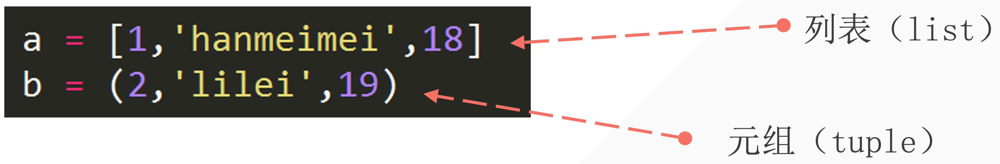

## 1. 创建元组

- 使用小括号创建
- 里面的元素用逗号隔开

```python
tup = (2, "x", "y")
print(tup, type(tup))

# output
(2, 'x', 'y') <class 'tuple'>
```

## 2. 列表和元组的对比



列表和元组的区别：

- 列表中：元素用方括号 [] 包裹；在元组中，元素用圆括号（）包裹
- 列表中的元素可以被修改，添加，删除，即列表是可变的数据类型，元组是不可变的数据类型。

## 3. 元组是不可变的

但凡我们想修改元组，是会报错：

```python
tup = (2, "x", "y")
tup[0] = 1

# output
Traceback (most recent call last):
  File "/Users/gaxa/Coder/Pythonfile/data_type.py", line 2, in <module>
    tup[0] = 1
    ~~~^^^
TypeError: 'tuple' object does not support item assignment
```

## 4. 元组的取值和分片操作

```python
tup = (2, "lilei", 19)
print(tup[1]) # output 2
print(tup[0], tup[2]) # output 2 19
print(tup[::2]) # output (2, 19)
print(tup[-2:-4:-1]) # output ("lilei", 2)
```

## 5. 元组的特点

思考一下：如果元组只有一个元素，是什么类型？

```python
tup = (1)
print(type(tup))

# output
<class 'int'>
```

代码运行后，我们可知：如果元组只有一个元素，那么元素本身的类型。

为什么会是这个结果呢？

- 我们常规在数学计算中括号是在运算的时候用来保证优先级和在适当的情况下，可以直接去掉。
- `(1 + 2) * (2 + 1) = (3) * (3) = 3 * 3 = 9` 所以，你可以发现 `(3) * (3) = 3 * 3` 左边的 `(3)` 不就是上面所说的“元组只有一个元素的情况”。也就类似于数学表达式中括号可以直接省去。

如何解决呢？ 加一个逗号

```python
tup = (1,) # 如果元组只有一个元素，加一个逗号以此区分
print(type(tup))

# output
<class 'tuple'>
```

## 6. 元组的拼接

直接使用加号拼接

```python
tup1 = (1, 2, 3)
tup2 = (4, 5, 6)
new_tup = tup1 + tup2
print(new_tup)

# output
(1, 2, 3, 4, 5, 6)
```

## 7. 元组的排序

### 7.1 小试牛刀 「根据现有的知识排序」

对以下元组进行排序：

```python
tup = (9, 7, 5, 3, 1, 2, 4, 6, 8, 0)
```

思路：

- 因为元组不可变，所以先把元组转换成列表
- 然后再进行排序
- 接着进行转换回元组

```python
tup = (9, 7, 5, 3, 1, 2, 4, 6, 8, 0)
lst = list(tup)
lst.sort() # 单独一行直接运行 修改lst
tup_new = tuple(lst)
print(tup_new)

# output
(0, 1, 2, 3, 4, 5, 6, 7, 8, 9)
```

### 7.2 使用 sorted()

实际上 sorted() 实现的也就是上面的流程

```python
tup1 = tuple(sorted(tup)) # sorted(tup)会自动将其转换为列表，需要再换回tuple
print(tup1)

# output
(0, 1, 2, 3, 4, 5, 6, 7, 8, 9)
```

## 8. zip()

zip() 是一个内置函数，用于将多个可迭代对象（如列表、元组或字符串）的相应元素配对并返回一个元组的迭代器。如果你有两个或更多的列表，并且想要根据它们的相应元素创建一个新的迭代器，那么 zip() 函数就非常有用。

1. 假设有两个列表：

```python
list1 = [1, 2, 3]
list2 = ['a', 'b', 'c']
```

可以使用 zip() 来配对这些列表的元素：

```python
zipped = zip(list1, list2)
```

zipped 现在是一个包含元组的迭代器，每个元组都由两个列表的相应元素组成。例如：

```python
list1 = [1, 2, 3]
list2 = ['a', 'b', 'c']
zipped = zip(list1, list2)
print(zipped)  # 是一个zip对象，迭代器地址
print(list(zipped))  # 转换成列表查看，也可以转换成元组
# print(*zipped)  # *号用来解包
# 当然也可以用循环，但是目前不涉及
# 上面的代码中如果用了列表，就不能再用*，因为zip已经被打开，数据已经被提取

# output
<zip object at 0x10454a200>
[(1, 'a'), (2, 'b'), (3, 'c')]
```

可以使用循环来遍历这个迭代器：

```python
for num, letter in zipped:
    print(f'Number: {num},Letter: {letter}')

# output
Number: 1,Letter: a
Number: 2,Letter: b
Number: 3,Letter: c
```

2. 元组同理：

```python
tup1 = (1, 2, 3)
tup2 = ('a', 'b', 'c')
zipped = zip(tup1, tup2)
print(zipped)  # 是一个迭代器地址
print(list(zipped))  # 转换成列表查看，也可以转换成元组
# print(*zipped)  # * 号用来解包

# ---output---
<zip object at 0x104f0d400>
[(1, 'a'), (2, 'b'), (3, 'c')]
```

