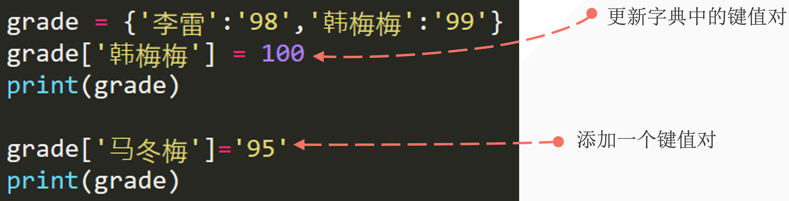
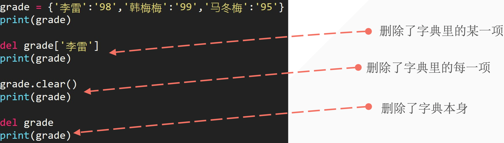
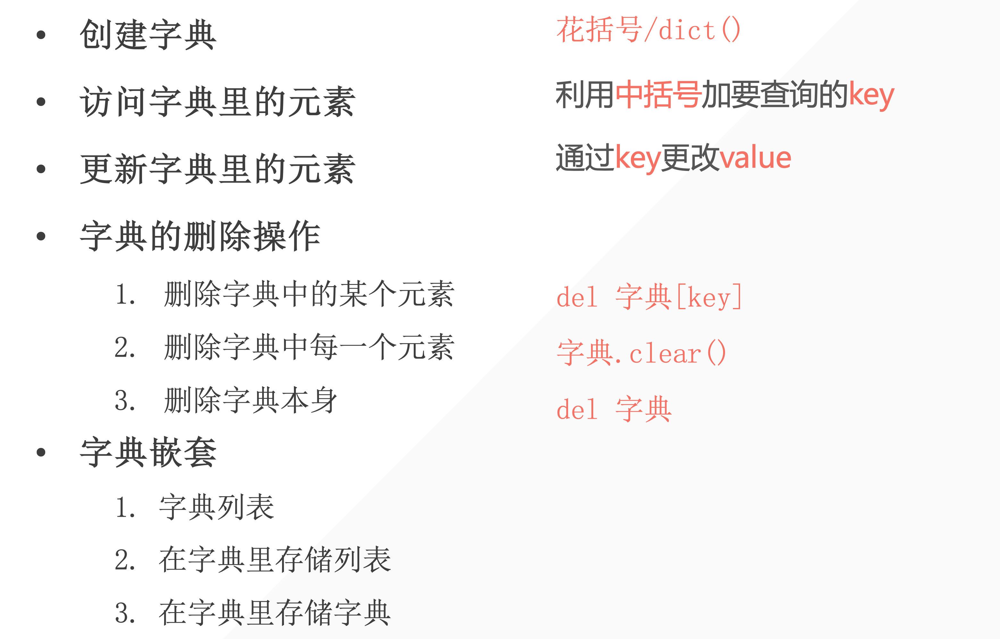

## 1. 如何创建一个电话簿

我们现在有以下联系人：

| 姓名        | 手机号 |
| ----------- | ------ |
| 李雷        | 123456 |
| 韩梅梅      | 132456 |
| 大卫        | 154389 |
| Mr.Liu      | 131452 |
| Bornforthis | 180595 |
| Alexa       | 131559 |

如何用以往学过的知识构建一个具有用户输入查询功能的电话簿。

> 变量、数字型、列表、元组、字符串。

程序运行效果：

- 测试一：

```python
Enter your search name: 李雷
The 李雷 phone number is: 123456
```

- 测试二：

```python
Enter your search name: Bornforthis
The Bornforthis phone number is: 180595
```

::: code-tabs

@tab method 1

```python
contacts = ['李雷', 123456, '韩梅梅', 132456, '大卫', 154389, 'Mr. Liu', 131452, 'Bornforthis', 180595, 'Alexa', 131559]
name = input('Enter your search name:>>> ')
name_index = contacts.index(name)
print(f"{name}'s phone number is {contacts[name_index+1]}")
```

@tab method 2 

```python
contacts_name = ['李雷', '韩梅梅', '大卫', 'Mr. Liu', 'Bornforthis', 'Alexa']
contacts_number = [123456, 132456, 154389, 131452, 180595, 131559]
contacts = list(zip(contacts_name, contacts_number))
name = input('Enter your search name:>>> ')
name_index = contacts_name.index(name)
print(f"{name}'s phone number is {contacts[name_index][1]}")
print(f"{name}'s phone number is {contacts_number[name_index]}")
```

:::

由上面的问题应该要了解两个点：

1. 如何用已有的知识去完成未知的新任务，毕竟不可能包含全部各种需求所需要的数据类型类型；
2. 字典存在意义，从上面题目完成后应该要 get 到。

## 2. 字典结构

- 用 **<span style="color:orange">花括号</span>** 表示字典
- 字典内每一项都有两个元素组成：**<span style="color:orange">key 和 value</span>**
    - `{key: value, key: value}`
- 各个项用 **<span style="color:orange">逗号</span>** 隔开

```python
phone_numbers = {'lilei': 1234, 'hanmeimei': 3456, 'madongmei': 1123}
print(phone_numbers['lilei']) # 提取某个value用[key]

# output
1234
```

## 3. 字典结构 key&value

- key 和 value 是一一对应，同一个键只能有一个对应的值
- 键的类型是不可变的；str/
- value 的类型是任意的；

```python
phone_numbers = {'lilei': 1234, 'hanmeimei': 3456, 'madongmei': 1123, True :'bool', 2:'int' }
print(phone_numbers)

# output
{'lilei': 1234, 'hanmeimei': 3456, 'madongmei': 1123, True: 'bool', 2: 'int'}
```

- 如果key用列表则会报错

```python
phone_numbers = {'lilei': 1234, ['hanmeimei']: 3456, 'madongmei': 1123, True :'bool', 2:'int' }
print(phone_numbers)

# output
Traceback (most recent call last):
  File "/Users/gaxa/Coder/Pythonfile/data_type.py", line 1, in <module>
    phone_numbers = {'lilei': 1234, ['hanmeimei']: 3456, 'madongmei': 1123, True :'bool', 2:'int' }
                    ^^^^^^^^^^^^^^^^^^^^^^^^^^^^^^^^^^^^^^^^^^^^^^^^^^^^^^^^^^^^^^^^^^^^^^^^^^^^^^^
TypeError: unhashable type: 'list'
```

## 4. 用字典dict函数创建字典

- 方法一：根据其他序列新建字典

```python
message = [('lilei', 98), ('hanmeimei', 99)]
list_to_dict = dict(message) # 把元组中1号位都变成value
print(list_to_dict)

# output
{'lilei': 98, 'hanmeimei': 99}
```

- 方法二：根据关键字参数新建字典

```python
d = dict(lilei=98, hanmeimei=99)
print(d)

# output
{'lilei': 98, 'hanmeimei': 99}
```

::: info 上面两种创建字典的方法，有什么优缺点？

上面方法一的方法，可以更好的适配字典的各种数据类型情况。why？——因为结构是列表里面放元组，而元组的 0 号位放 key，1 号位放 value。所以，只要是不可变的数据类型都可以放在 0 号位。

反之对比上面方法二：第一个位置必须是“变量”，不能是其它数据类型。举个例子：

```python
d = dict(lilei=98, hanmeimei=99)  # 看起来正常 lilei是变量
d = dict('lilei'=98, 'hanmeimei'=99)  # 看起来怎么样？‘lilei’是value
  File "/Users/gaxa/Coder/Pythonfile/data_type.py", line 1
    d = dict('lilei'=98, hanmeimei=99)
             ^^^^^^^^
SyntaxError: expression cannot contain assignment, perhaps you meant "=="?
# value 不能被赋值为另一个 value，value之间只能用 ==
```

上面第二行代码，看起来就很奇怪了，一共有两个值一个值是 `'lilei'` 另一个值 `98` 两个都是值，可以用 98 赋值给另一个值吗？——显然是不行的。我们的赋值是需要把一个值赋值给一个变量「有空间」。

所以，第二种方法虽然可以实现创建字典，但是对于字典 key 的各种情况并不能完全支持。

output时 第二种的 key 只会是字符串

## 5. 访问字典的数据

### 5.1 用中括号访问

- 利用中括号加要查询的 key

```python
grade = {'lilei': 98, 'hanmeimei': 99}
print(grade['hanmeimei'])
```

### 5.2 上面的提取方法存在的问题

在提取不存在的key时会报错

```python
grade = {'lilei': 98, 'hanmeimei': 99}
print(grade['ma'])

# output
Traceback (most recent call last):
  File "/Users/gaxa/Coder/Pythonfile/data_type.py", line 2, in <module>
    print(grade['ma'])
          ~~~~~^^^^^^
KeyError: 'ma'
```

就像我们查询电话簿的时候，没找到会返回：未找到。


### 5.3 使用.get()解决

当使用 `get` 方法时，需要提供一个键（key），方法会返回与该键关联的值。如果该键在字典中不存在，`get` 方法将返回 `None`，或者你可以指定一个默认值，如果键不存在，则返回这个默认值。

这是 `get` 方法的基本语法：

```python
value = dictionary.get(key, default_value)
```

- `key`：你想要检索的键。
- `default_value`：（可选）如果键不存在时返回的值。如果未提供此参数，默认值为 `None`。

下面是一个使用 `get` 方法的例子：

```python
grade = {'lilei': 98, 'hanmeimei': 99}
print(grade.get("lilei"))
print(grade.get("ma")) # 如果key不存在则会返回默认值None
# 如果单独设定在 key 不存在时所指定的返回内容
print(grade.get("ma", "Not specified")) 

# output
98
None
Not specified
```

在第一个 `get` 调用中，我们访问了键 `'name'`，它在字典中存在，因此返回了对应的值 `98`。在第二个调用中，我们试图访问键 `'ma'`，它在字典中不存在，因此返回了我们指定的默认值 `'Not Specified'`。

## 6. 更新字典的数据

字典修改或添加数据原则：有则改之，无则加勉「无则添加」



```python
grade = {'lilei': 98, 'hanmeimei': 99}
grade['lilei'] = 95
grade['madongmei'] = 100
print(grade)

# output
{'lilei': 95, 'hanmeimei': 99, 'madongmei': 100}
```

## 7. 字典数据删除



```python
grade = {'A': 98, "B": 99, "C": 95}
print(grade)
del grade['A']
print(grade)

# output
{'A': 98, 'B': 99, 'C': 95}
{'B': 99, 'C': 95}
```

```python
grade.clear()
print(grade)

# output
{}
```

```python
del grade  # the variable would be deleted hence not able to print
print(grade)

# output
Traceback (most recent call last):
  File "/Users/gaxa/Library/Containers/com.tencent.xinWeChat/Data/Library/Application Support/com.tencent.xinWeChat/2.0b4.0.9/c6f75b68835a096ebee7933989e7770c/Message/MessageTemp/4b975e58c46c58ce379c1852275bb5cf/File/python.py", line 10, in <module>
    print(grade)
          ^^^^^
NameError: name 'grade' is not defined
```

## 8. 字典结构嵌套字典

嵌套：将一系列字典存储在列表中，或将列表作为值存储在字典中。

- 字典列表
- 在字典中存储列表
- 在字典中存储字典

### 8.1 字典列表

```python
student1 = {'name': "A", "age": 18, "grade": 98}
student2 = {'name': "B", "age": 19, "grade": 99}
student3 = {'name': "C", "age": 18, "grade": 95}
students = [student1, student2, student3]
print(students)

print(students[2]["grade"])
print(students[2].get("grade"))
```

:::: tip 小试牛刀：通过提取 students 来得到 韩梅梅的分数

::: code-tabs

@tab Code1

```python
print(students[2]['grade'])
```

@tab Code2

```python
print(students[2].get('grade'))
```

:::

中括号和 get 的选择依据：看数据是否是确定的，如果是确定的优先使用中括号提取。否则，使用 get。

::::

### 8.2 在字典中存储列表

```python
favorite_class = {
    'A': ["math", "english"],
    'B': ["chinese"],
    'C': ["computer science", "physics", "math"]
}
print(favorite_class["C"][2])
# output
math
```

### 8.3 在字典中存储字典

```python
student1 = {"name": 'A', "grade": 98, "实验班": True}
student2 = {"name": 'B', "grade": 95, "实验班": True}
student3 = {"name": 'C', "grade": 89, "实验班": False}
class1 = {"A": student1, "B": student2, "C": student3}
print(class1)
print(class1["C"]["实验班"])

# output
False
```

## 9. 字典常见方法

### 9.1 .pop(key)

删除特定的键对值

```python
student1 = {"name": 'A', "grade": 98, "实验班": True}
student1.pop("实验班")
print(student1)

# output
{'name': 'A', 'grade': 98}
```

### 9.2 .keys()

获取字典中的所有键

```python
student1 = {"name": 'A', "grade": 98, "实验班": True}
keys = student1.keys()
print(keys)
print(list(keys))

# output
dict_keys(['name', 'grade', '实验班'])
['name', 'grade', '实验班']
```

### 9.3 .values()

获取字典中的所有值

```python
student1 = {"name": 'A', "grade": 98, "实验班": True}
values = student1.values()
print(values)
print(list(values))

# output
dict_values(['A', 98, True])
['A', 98, True]
```

### 9.4 .items()

获取字典的键对值，以tuple的形式

```python
student1 = {"name": 'A', "grade": 98, "实验班": True}
values = student1.items()
print(values)
print(list(values))

# output
dict_items([('name', 'A'), ('grade', 98), ('实验班', True)])
[('name', 'A'), ('grade', 98), ('实验班', True)]
```

### 9.5 in

1. 默认情况是判断key在字典中

```python
student1 = {"name": 'A', "grade": 98, "实验班": True}
print("name" in student1)
True
```

2. 使用keys实现纯粹判断

```python
student1 = {"name": 'A', "grade": 98, "实验班": True}
print("name" in student1.keys())
True
```

3. 使用values实现纯粹判断

```python
student1 = {"name": 'A', "grade": 98, "实验班": True}
print("name" in student1.values())
False
```



