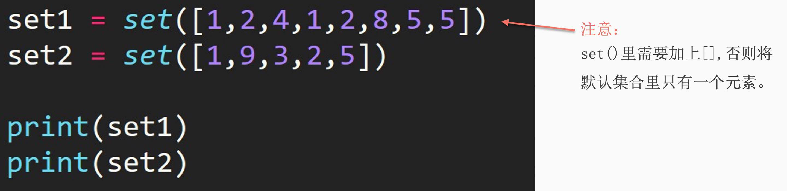

## 1. 创建集合

1. 直接使用花括号创建

```python
set1 = {1, 2, 3, 4, 5}
```

2. 使用 set() 方法



## 2. 集合的交集

交集：intersection，求两个集合中都出现了的元素， 用`&`运算符实现

```python
set1 = {1, 2, 3, 4, 5}
set2 = set([1, 2, 5, 6, 8])
print(set1 & set2)

# output
{1, 2, 5}
```

## 3. 集合的并集

并集：union，求两个集合中共有的元素，用 `|` 运算符实现

```python
set1 = {1, 2, 3, 4, 5}
set2 = set([1, 2, 5, 6, 8])
print(set1 | set2)

# output
{1, 2, 3, 4, 5, 6, 8}
```

## 4. 集合的差集

差集：difference，求set1和set2的差集时，会返回在set1中但不在set2中的元素，用`-`运算符实现

```python
set1 = {1, 2, 3, 4, 5}
set2 = set([1, 2, 5, 6, 8])
print(set1 - set2)

# output
{3, 4}
```

## 5. 集合的对称差集

对称差集：symmetric difference，求set1和set2的对称差集时，会返回在set1或在set2中，但不同时存在于两个集合中的元素，用运算符`^`实现 –> 等于并集减去交集，韦恩图

```python
set1 = {1, 2, 3, 4, 5}
set2 = set([1, 2, 5, 6, 8])
print(set1 ^ set2)

# output
{3, 4, 6, 8}
```

## 6. 思考

对称差集可以用其他三种集合操作来实现吗？如何实现？

用并集减去交集

```python
set1 = {1, 2, 3, 4, 5}
set2 = set([1, 2, 5, 6, 8])
U = set1 | set2
N = set1 & set2
print(U - N)

# output
{8, 3, 4, 6}
```

## 7. .add() 添加集合元素

```python
set1 = {1, 2, 3, 4, 5}
set2 = set([1, 2, 5, 6, 8])
set1.add(9)
print(set1)

# output
{1, 2, 3, 4, 5, 9}
```

