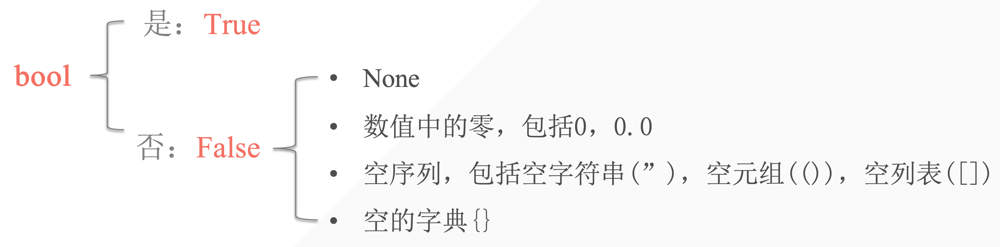
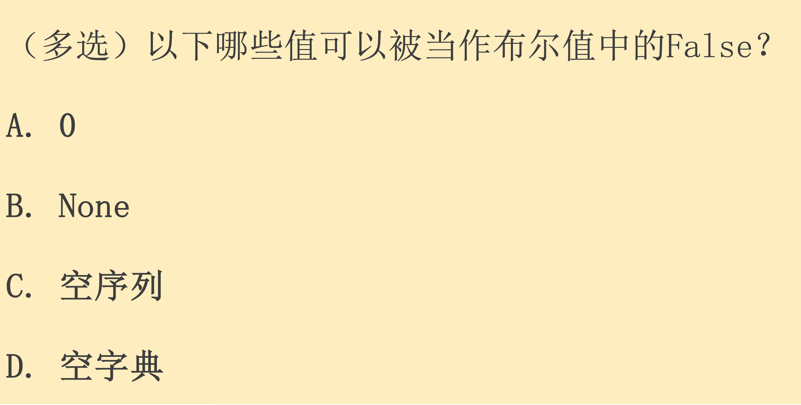

## 1. 布尔值

意义：表示判断中的是与否。一般用于测试条件中。

```python
a = True
print(a)
print(10 < 5)
print(10 > 8)

# output
True
False
True
```



- 所有的非空值就是 True
- 所有的空序列，空数字为 False


## 2. 逻辑运算符

逻辑运算符：用于检测两个以上的条件是否满足

逻辑运算符只存在于布尔当中

| 逻辑运算符       | 描述                                                       |
| ---------------- | :--------------------------------------------------------- |
| and 「逻辑“与”」 | 当运算符两边的两个运算对象都为True时，结果为True           |
| or 「逻辑“或”」  | 当运算符两边的两个运算对象其中有一个为True时，结果即为True |
| not 「逻辑“非」  | 用于反转运算对象的状态                                     |

| exp         | bool           | value | Return value  ===  print(exp)                                |
| ----------- | -------------- | ----- | ------------------------------------------------------------ |
| 3 and 5     | True and True  | True  | 5       *从3开始往右运行 运行到5也是True 返回5 (需要两个都True) |
| 3 or 5      | True or True   | True  | 3       *or只需要一个True 到3就可以了                        |
| 0 or 5      | False or True  | True  | 5       *到5才满足条件                                       |
| 3 and not 5 | True and False | False | False                                                        |
| 0 and 5     | False and True | False | 0        *0和false是一样的                                   |

```python
s1 = {False, 0}
s2 = {0, False}
print(s1, s2)

# output
{False} {0}  # set会自动去除后面和前面重复的 - 说明0和false等价
```

```python
In [5]: True and False or True 
Out[5]: True
# 先算and右边的 从右往左

In [6]: False or False or not False
Out[6]: True
```


## 3. 表达式应用 — 条件测试

- 检查当前变量是否与一个特定值相等
- 比较数字的大小
- 检查特定值是否在某序列里

### 3.1 多条件检查

使用and检查多个条件

```python
age1 = 17
age2 = 18
print(age1 >= 18 and age2 >=18)
print(age1 >= 15 and age2 >=18)

# output
False
True
```

使用or检查多个条件

```python
age1 = 17
age2 = 18
print(age1 >= 18 or age2 >=18)
print(age1 >= 15 or age2 >=18)

# output
True
True
```



